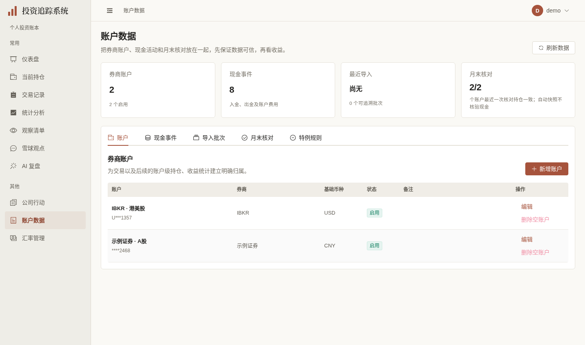
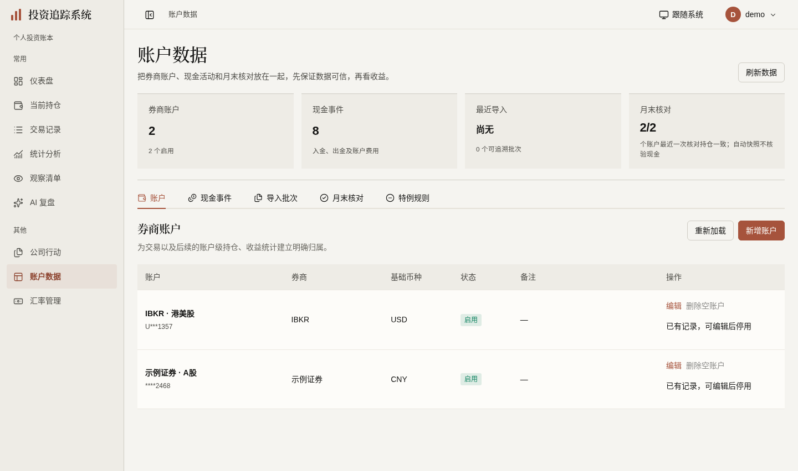
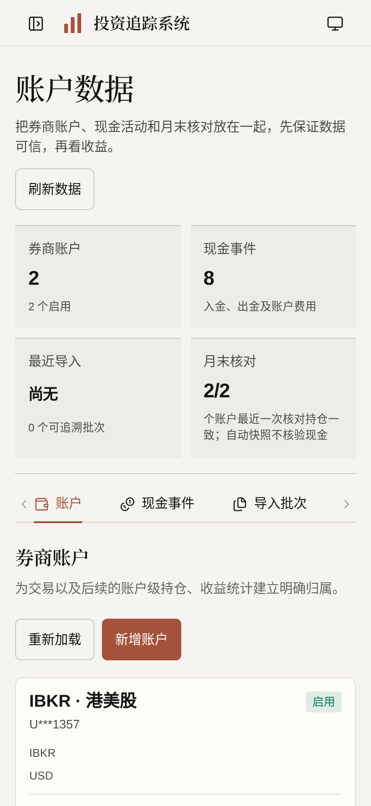

# 账户数据展示验收（2026-10-03）

按[计划第33节](../FRONTEND_UI_UPGRADE_PLAN.md)，`codex/account-data-ui` 基于汇率[#428](https://github.com/measimov/investment-tracker/pull/428)的d209357（e05904f6正常同步用户已合入的main，仅继承#426一行测试）。仅本页展示、实际读取未知/错误/成功范围及批次详情身份保护；保留五个原ElTabs实例、复杂表单/批次ElDrawer/核对详情成熟机制。无API、模型、算法、迁移、真实导入或外部任务。

## 同demo正式图

旧428与新预览共享专用虚构demo库；五读取完整JSON相等：2账户、8现金事件、0批次、3核对记录、0规则，原最近一次核对汇总2/2。未为截图新增账户或现金。正式1440×852@1、393×852@2，等待数据/字体/动画完成；正常捕获1项通过，两图无请求失败、JS异常或连接横幅。

| 旧页 | 新页 | 手机 |
|---|---|---|
|  |  |  |

## 实际问题与最小修复

- 初次四读取503曾显示账户/现金0、尚无导入、核对0/0和“新增第一个账户”。沿原makeLoader与账户status补每类成功/error，仅成功数据形成汇总；未知为—，成功空才是真空，失败保留上次成功并说明未确认最新结果，各自GET重试。规则保留原序号守卫，捕获成功类型，失败或载入不把旧范围称为当前筛选。
- 批次A详情挂起→Esc关闭→B详情成功→迟到A曾覆盖B。直接复用useLatestRequest与当前开窗/ID，当前成功/error/finally才可更新；失败保留此批次列表元数据并明确未确认详情。关闭、迟成功、迟503、393px ABA实际通过，不构建请求或抽屉平台。
- 显示复用现有现金类型/金额/纯日期helpers；现金方向仍按原类型映射、原amount为正数，负号在币种前。每币种现金核对摘要/余额明示币种；数量及差额原helper不改。ADS比例字符串0.125、规则保存解析、分范围“持仓一致”、排除规则/现金不比对说明、8位股息税分摊/阈值与所有ISO提交值保留。
- 五个实际列表用Naive表格/按钮、手机完整读卡；有限筛选采用具名原生select，成熟ElTabs/表单/抽屉/比对详情继续保留。原has_records禁删、maskAccountNumber、导入read_only及来源完整。列表1000上限标明只在已加载范围内，满额1000+不是完整总数。
- 初版实际网格自动最小宽度撑出页面，局部minmax(0,1fr)约束后15态和根50态无外层溢出。压力长备注曾令首行391–481px且旁列大片留白，4个实际备注调用复用本feature微小presentation helper，长文原位native details完整展开、短文直接读，未截断正文；根首行降146/145/145/57px。工具栏手机44高、行操作44×44，桌面至少24；成熟表单本地具名/mask与清旧校验，原保存控制器不改。

- 股息税弹窗保存、取消曾因父v-if立即卸载而丢失库焦点返回；沿ElDialog公开v-model/closed关闭完成后才通知父清理。取消/Esc通过后保存仍失败，挂起PUT探针确认ElButton loading使焦点落到body，而原入口始终为同一DOM。仅保存按钮复用已引入NButton公开loading，原saving和库click/Enter保护保持，补aria-busy/aria-disabled；根三宽保存pointer/取消pointer/Esc均回原入口，两宽挂起PUT重复pointer及Enter仍仅1次请求。原8位分摊、候选与保存控制器不变，无手工focus补丁。

## 六维实际依据

| 维度 | 实际依据 | 范围与限制 |
|---|---|---|
| 视觉与风格 | 暖白/暖灰/陶土、宋体页头、四项汇总和薄行分隔；正式三图逐张自查，长备注原位展开避免表格大片空白 | 本页展示，无主题/表格平台或获奖级自评 |
| 内容与可信度 | 同demo五API完整JSON相等；根合法长名/多币/只读/股票范围/0.125比例fixture保持原值，纯09-30日期与UTC23:30本地次日正确；财务方向、尾号遮罩、名单范围保持 | 压力记录仅浏览器明确虚构，不入库，不补未知金额、归属或规则 |
| 任务与交互 | 原税归属/核对自动比对与口径/规则分类型payload/慢筛选/导入原回归通过；根5读取503→GET重试、真空、旧值、规则范围、现金1000+，四类批次乱序及三宽税归属精确payload/失败/取消/保存通过 | 财务保存只在独立E2E库；根状态/批次均GET虚构响应，无真实导入 |
| 响应式与可访问性 | 自查1440/393/320×5tab，根10宽×5tab（含640/641与720×450）document/body均等viewport；原生有限筛选、成熟tabs键盘、批次关闭与重试；根两宽四tab备注Enter展开完整/收起、393toolbar44与行44×44；税弹窗三宽保存/取消/Esc返回与两宽busy防重真实通过 | 720×450为200%等效CSS重排，非literal浏览器缩放；沿成熟/原生焦点，未建ARIA平台或宣称完整读屏认证 |
| 状态与对比度 | 实际说明rgb116/111/101对暖底250/249/245约4.74:1；启用tag合成白底约4.63:1；未知—、错误/旧范围默认可见，完整错误原因可原位打开 | 不改全局token，正常与明确虚构失败分别检查 |
| 性能与维护 | 同demo1440×852生产构建、4倍CPU、5轮交替初样gzip JS316993→404301bytes；最终税弹窗局部修复后单独重采404389bytes，增加85.3KiB/27.6%，主要为已存在DataTable等双库过渡控件；原五读取路径一致 | 不因数字增量建拆包设施；本地短样本且同机验收并行，不代表生产或全面性能提升 |

## 短样本原值

| 轮次 | 旧FCP(ms) | 新FCP(ms) | 旧数据就绪(ms) | 新数据就绪(ms) |
|---|---:|---:|---:|---:|
| 1 | 188 | 180 | 898.7 | 798.2 |
| 2 | 160 | 152 | 821.0 | 791.0 |
| 3 | 204 | 172 | 869.5 | 767.1 |
| 4 | 156 | 172 | 841.8 | 827.6 |
| 5 | 204 | 172 | 1017.7 | 888.1 |

这五轮计时在税弹窗最后生命周期/保存按钮修复之前采样；最后只重采资源（404389bytes，比初样增加88bytes），没有重复计时。FCP中位188→172ms，数据就绪869.5→798.2ms；仅本机短样本。资源encodedBodySize为gzip口径。请求同为auth/me、broker-accounts?limit=1000、cash-events?limit=1000、import-batches?limit=1000、reconciliation-snapshots?limit=1000、security-rules及既有auth/refresh；没有通过新懒加载删掉原取数。

## 验证时点与剩余范围

- 428单元（59文件）通过。首次12项定向9通过/3失败：新状态测试误把已成功的隐藏tab全文当可见未知态、税按钮旧名称、规则`.first()`指向新原生筛选的隐藏option；仅精准定位可见tabpanel/具名税动作/成熟实际可见dropdown，不动金融断言；修后12项全通过。
- 完整本地E2E125通过/4既有跳过/1旧mobile-sweep删除名称失败；精准改具名对象名称后原长卡内容/动作边界回归1通过。该完整门禁在最终税焦点修复前。新增税焦点回归初跑3通过/1真实保存焦点失败，确认loading原因并局部修复后最终税生命周期/busy防重与既有税事实2项通过（20.6s）。未把分次结果拼成“修后完整clean”；新提交远端完整CI待完成。
- [#429](https://github.com/measimov/investment-tracker/pull/429)首轮head73a9de4完整CI37118684273：后端3407/6跳过、428单元通过，E2E126通过/1失败/4跳过。唯一失败是新增状态spec未指定浏览器时区，却期待UTC时间戳在上海跨日至10/03；CI浏览器UTC正确显示10/02，同断言重试仍失败。仅本spec用公开test.use明确Asia/Shanghai，UTC宿主下3项定向通过（27.4s）。同一产品与合法只读fixture在UTC/Shanghai分别显示10/02、10/03，纯日期均09/30；无formatter、全局配置或财务断言变化。当前ae9c58d完整CI37119431251已通过：后端3407/6跳过、428单元（59文件）、E2E127/4跳过，无失败或重试；首次失败历史保留。
- OpenAPI首次命令缺venv PATH，未计成功；用正确既有Python3.12环境重生成后无漂移。最终格式、类型与生产构建检查通过，自动组件声明无关漂移恢复；无后端变更，不重复pytest。
- 捕获首次因本机API进程随定向服务关闭导致login拒绝，丢弃该轮；恢复独立进程组后正常两图捕获通过，未改应用或隐藏错误横幅。
- 父#428 e059远端37115201205：后端3407/6跳过、428单元、E2E124/4跳过，无失败或重试，base已由根改main；随后只同步已合入的main一行测试，父head d209357的完整CI37117547240也已通过：后端3407/6跳过、428单元（59文件）、E2E124/4跳过，无失败或重试；旧e059结果单列。前序#421–#427由用户合入，当前分支仅继承已完成内容，不合并PR或部署。
- 本机证据：`/tmp/account-data-first-review.json`、`account-data-api-parity.json`、`account-data-contrast.json`、`account-data-performance.json`、`account-data-targeted.log`、`account-data-targeted-final.log`、`account-data-e2e-full.log`、`account-data-last-targeted.log`、`account-data-unit.log`、`account-data-api-types-final.log`、`account-data-demo-capture-final2.log`、`account-data-tax-final-targeted3.log`、`account-tax-focus-cause.json`、`account-data-final-resources.json`、`account-data-timezone-targeted.log`、`account-data-timezone-review.json`。根独立`account-data-root-responsive.json`、`account-batch-drawer-root-after.json`、`account-data-root-state.json`、`account-data-root-final-details.json`覆盖50响应式态、4批次乱序、5状态与备注/触控，业务写/外呼/JS错误零。最终根`account-data-root-tax.json`与`account-data-root-tax-busy.json`覆盖320/393/1440的mask草稿、未知gross、纯日期、候选503及焦点，393/1440挂起PUT的busy/焦点/防重；所有PUT为浏览器明确虚构响应。
- 原复杂账户/现金/快照/规则和税分摊表单仍为成熟Element实现，未声称全站或本页彻底移除Element。意见源/管理员页与独立D3尚未完成，总体#362/#367/#368/#369/#370/#353仍open，不自动关闭。
