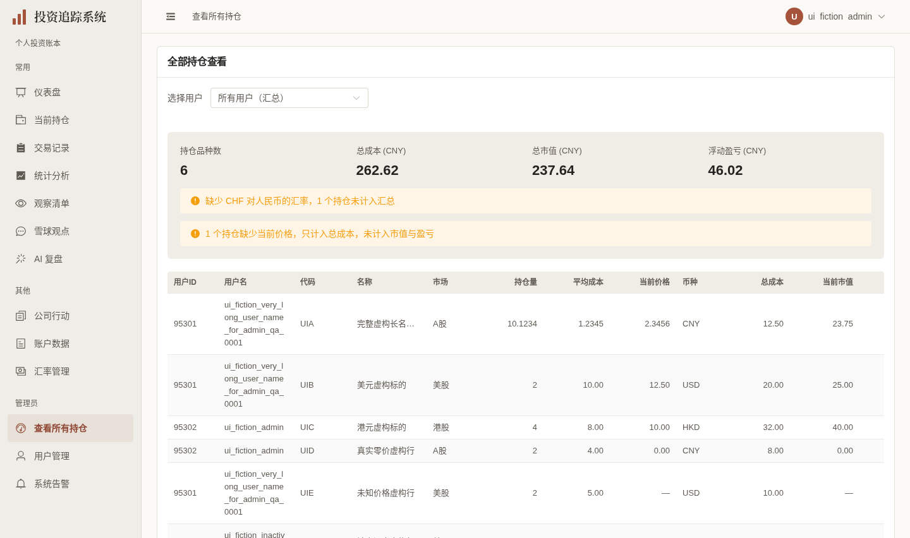
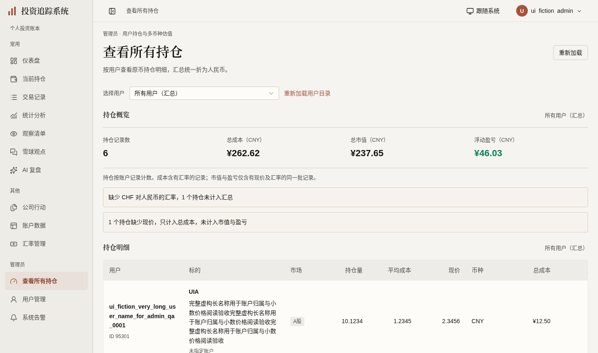
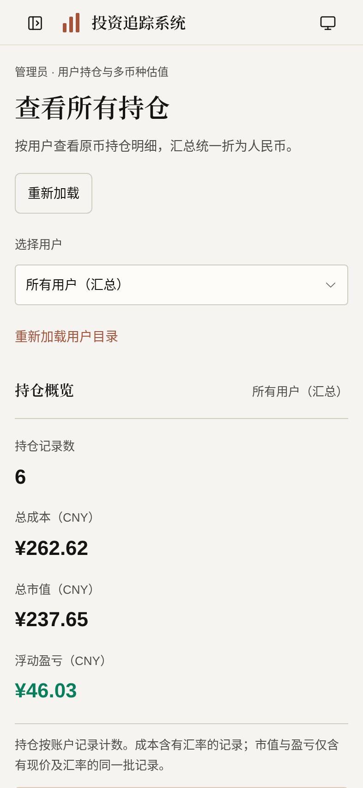

# 管理员持仓展示验收（2026-10-03）

按[计划第36节](../FRONTEND_UI_UPGRADE_PLAN.md)，`codex/admin-holdings-ui` 基于开放的[用户管理#431](https://github.com/measimov/investment-tracker/pull/431)。仅本页展示、原读取状态与必要表格组件；保留原管理员路由/API权限、活跃用户选择、ALL哨兵0与清空行为，不改变持仓接口、财务算法、汇率缓存、账本或迁移。

## 同输入正式图

同一[明确虚构合法6持仓/3用户/2汇率fixture](admin-holdings-ui-fixture.json)，只在专用demo浏览器GET响应模拟，不写演示库。管理员标志仅UI场景，不冒充权限验证。旧新版1440×852@1、手机393×852@2，上海时区，等待数据/字体/动画并检查加载遮罩、连接横幅、失败请求；正式capture1通过4.3s，外部与业务写入阻断，实际错误零。

| 旧页 | 新页 | 手机 |
|---|---|---|
|  |  |  |

同输入原helper人民币成本262.62、市值237.64544704、盈亏46.02544704完全保持。旧ElStatistic截断显示237.64/46.02；本轮沿既有formatCurrency显示237.65/46.03，纠正最后一分展示舍入，不是财务金额或算法增加。原币明细保留币种、10.1234数量、1.2345成本/2.3456价格、真实0价和缺价—；缺CHF汇率的原币记录仍完整显示，只不计人民币汇总。

## 实际问题与最小修复

- 原用户/持仓首次503易显示暂无。两个原loader分别维护成功/error，沿useLatestRequest守卫结果/失败/finally。首次未知为—及尚未成功，成功空才0/暂无；刷新失败保留上次成功数据，分别GET重试。用户目录100条限制明确当前范围，仍只列其中活跃用户；ALL持仓继续包含非活跃用户已有记录。
- 捕获请求时的用户ID作为成功身份，旧A成功/失败不覆B，切A失败时ALL数据不冒充A。概览/明细均标实际成功范围，当前选择与成功范围不同时明确旧范围；清空仍GET/all和哨兵0。无新查询或状态平台。
- 直接复用rowMarketValue/rowProfit/rowProfitPercent/summarizeAdminHoldings，不把缺价当0或原币相加；只在展示层将完全无汇率/无估值覆盖标—，真正零价仍0，真空已确认后0。原成本覆盖与市值/盈亏同一有价、有FX批次解释常显。
- 旧SPA重新进入时latest FX503仍有共享旧缓存但本页无持续说明。仅复用useExchangeRates原loadFailed与原GET加载，持续提示最新未确认/已有汇率，缺币继续剔除；重试只多一次FX GET，不改缓存、来源、日期或刷新规则。
- 暖色宋体页头与薄分隔数字，必要AdminHoldingsTable提供Naive桌面局部横滚/手机完整读卡。未指定账户复用既有UNASSIGNED_ACCOUNT_LABEL常量；账户仅展示响应已有ID/未指定，不新增账户查询或猜名称；原时间未排序/升/降三态用具名原生按钮，原顺序及formatDateTime保持。
- 实际原ElSelect长用户名+邮箱在320/393/640/641/720px将document撑到739px。只公开fit-input-width和本页选项全文换行，保留实际具名combobox、键盘选择、完整option名称与clear0；最终十宽浮层四边/页面宽度通过，不造定位算法。
- 完整前端门禁发现既有batch-jobs helper将关闭动画中仍visible的旧任务按钮当作已开；任务进度确为running，但旧aria-disabled=false的DOM随后卸载。单独复验同失败。仅helper读取真实trigger aria-expanded，关闭时先等待旧action DOM消失再重新打开；无sleep、timeout放宽或runtime改动，原禁用、任务、键盘、进度断言不变。

## 六维实际依据

| 维度 | 实际依据 | 范围与限制 |
|---|---|---|
| 视觉与风格 | 同输入三图逐张检视，暖白/暖灰/陶土、宋体标题、薄分隔与原币列对齐；长姓名/标的完整，手机金额不缩小 | 本页局部，无主题/表格/加载平台，无获奖级自评 |
| 内容与可信度 | 原helper原值保持；原币精度、未知/真0、缺价/缺FX、实际成功用户身份与账户ID；明确237.64→237.65、46.02→46.03展示舍入 | fixture完全虚构，管理员mock仅UI。另真实普通demo访问管理路由回仪表盘、GET/admin/all403且页面未读此接口 |
| 任务与交互 | 双首次503分别GET重试、旧成功保留、A成功/失败迟到不覆B、清空ALL0、SPA缓存FX失败持续提示/只读重试；原排序三态真实键盘 | 无业务写入，无账户或汇率新取数，全部原controller/helper复用 |
| 响应式与可访问性 | 根十宽320–1920最终页面/完整选项浮层四边安全，实际姓名/价格与负号完整；手机44px、桌面排序至少24；大额¥9,876,543,120.99/-¥123,456.79不裁剪；另720×450重排 | 720×450是200%等效CSS宽度测试，不冒充literal浏览器缩放；不宣称完整读屏认证，不自建ARIA/焦点机制 |
| 状态与对比度 | 未加载/失败/成功空/旧范围/部分覆盖区分；393/1440真实行情标签、提示与正负金额对比最低约5.48:1 | 沿已有暖色token与盈亏语义，不改全局分类色；源未知不补零 |
| 性能与维护 | 同fixture、生产构建、1440×852、CPU4、减弱动态五轮JS gzip245925→299427bytes，初样增加52.25KiB/21.8%，最后同输出常量复用后gzip300651bytes，增加53.44KiB/22.3%；初始4 GET完全相同 | 双库/本页DataTable成本增加；本地短样本就绪略慢，不推导生产或全面提升，不建拆包框架 |

## 同条件短样本

| 轮次 | 旧FCP(ms) | 新FCP(ms) | 旧数据就绪(ms) | 新数据就绪(ms) |
|---|---:|---:|---:|---:|
| 1 | 172 | 152 | 641.6 | 658.1 |
| 2 | 156 | 156 | 587.5 | 638.2 |
| 3 | 156 | 152 | 596.2 | 636.4 |
| 4 | 152 | 152 | 592.1 | 656.1 |
| 5 | 152 | 152 | 583.0 | 631.7 |

FCP中位156→152ms、数据就绪592.1→638.2ms。encodedBodySize为gzip口径，初样差53502bytes；最后仅复用已有UNASSIGNED_ACCOUNT_LABEL后资源重采300651bytes，最终差54726bytes（53.44KiB/22.3%），未把其并发门禁中的单次计时混入本表；同生产/视口/虚构响应/四倍CPU的本地五轮，不能推广为生产性能结论。此前与根浏览器重叠的样本已作废，未混入本表。初始GET均为auth/me、users、holdings/admin/all、exchange-rates/latest，无额外读取。

## 验证时点与残项

- 428单元（59文件）通过，API类型重新生成零漂移；格式/类型/生产构建通过。没有后端/迁移或helper算法变化，不重复后端pytest。
- 初次4定向2通过/2测试定位失败（错误套用其他fixture金额、点击readonly输入被placeholder遮住）；仅断言用实际合法fixture值、真实focus/ArrowDown开启成熟select后4通过13.6s。长选项修复及实际窄屏回归后5通过14.2s。
- 完整首次139通过/1失败/4既有跳过，唯一既有batch-jobs关闭动画测试竞态在独立复验同失败；原日志保留。最小helper同步后原定向1项17.1s通过，显式单worker完整执行到130通过/4跳过后会话SIGTERM退出143，未出现产品失败断言且没有总结果，剩6项未执行；该中断证据保留，另用独立后台runner最终完整重跑140通过/4既有跳过（4.3m），exit0，无失败/重试，不把定向拼成全量clean。远端CI待提交后验。
- 父#431的71bf29d完整远端CI37123168151通过：后端3407/6跳过、428单元（59文件）、E2E135/4既有跳过，无失败或重试；父本地完整与最后Boolean/标签定向时点另记，不互相拼数。
- 本机证据：`/tmp/admin-holdings-targeted.log`、`targeted-final.log`、`targeted-fit.log`、`admin-holdings-e2e-full.log`、`admin-holdings-e2e-final.log`（中断）、`admin-holdings-e2e-complete.log`、`admin-holdings-e2e-complete.exit`、`admin-holdings-batch-recheck.log`、`admin-holdings-batch-fixed.log`、`admin-holdings-unit.log`、`admin-holdings-api-types.log`、`admin-holdings-typecheck.log`、`admin-holdings-format.log`、`admin-holdings-build.log`、`admin-holdings-build-final.log`、`admin-holdings-typecheck-final.log`、`admin-holdings-format-final.log`、`admin-holdings-final-resources.json`、`admin-holdings-selector-bounds.json`、`admin-holdings-performance.json`、`admin-holdings-contrast.json`、`admin-holdings-permissions.json`、`admin-holdings-capture.log`。临时配置/脚本/日志和会话不入库，组件生成无关漂移恢复。
- 根独立证据：`/tmp/admin-holdings-root-before.json`（原值/旧截断/FX缓存），`admin-holdings-root-state.json`六状态；首版`admin-holdings-root-responsive-before-fit.json`十宽core通过但5宽popup实际失败，最终`admin-holdings-root-responsive.json`十宽含popup全部安全；`admin-holdings-root-scope-fx.json`三场景，`admin-holdings-root-reflow.json`两大额/重排场景。全数虚构只读，真实业务写/外呼/JS错误零。
- 系统告警、独立来源D3及第13/15节退出抽样仍继续各自最小PR；总体#362/#367/#368/#369/#370/#353仍有残项，不自动关闭、合并或部署。

父修复同步说明：原65f63016完整CI37125684746通过是34.2采集开关P2修复前历史；沿真实父链正常merge后的c3a3c19完整CI已核实后端3407/6跳过、428单元59文件、E2E142/4跳过，无失败/重试；未改本页产品。原门禁/资源/截图时点保留，不用旧通过冒充新head结果。
