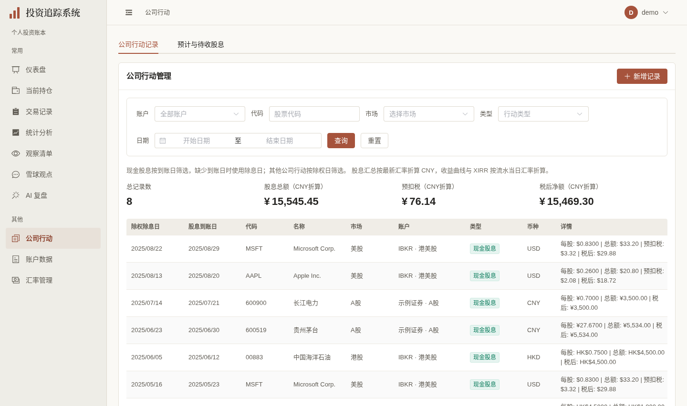
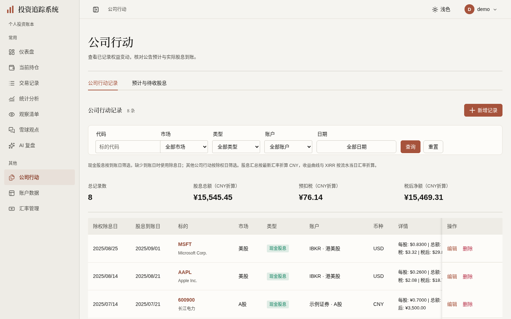
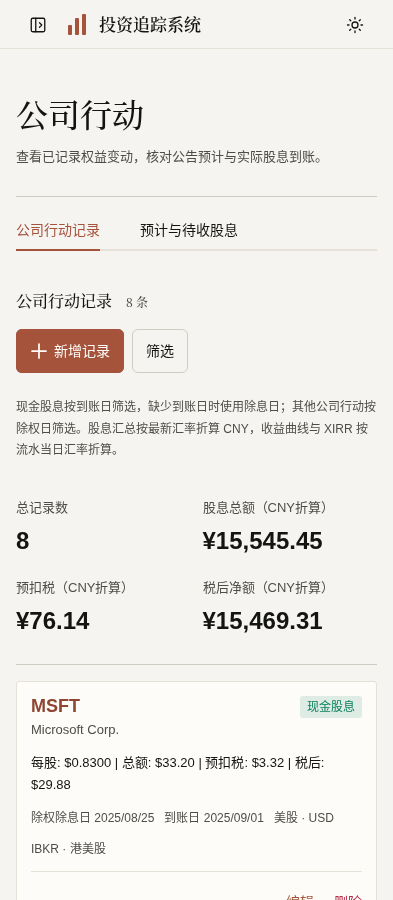

# 公司行动与预计/待收股息展示验收（2026-10-03）

依据[已确认计划第26/27节](../FRONTEND_UI_UPGRADE_PLAN.md)。分支 `codex/corporate-actions-ui` 基于 [#421 统计展示](https://github.com/measimov/investment-tracker/pull/421) 最新 `01a9bde8`；该依赖尚未合入时本PR以统计分支为base，仅审阅公司行动差异。本轮改善既有记录、预计与待收列表及到账关联，不改API、财务算法、数据库迁移、历史账本或后台任务能力。

## 同数据正式图

独立虚构demo账本与静态行情，周期任务、外部凭据关闭；未重灌、自动到账或保存报价。基线为统计分支上的旧公司行动页，新版同一库8条记录。桌面1440×852 @1x、手机393×852 @2x，等待字体、请求和动画稳定后捕获最终构建。既有 `demo:capture` 只增加本页桌面与手机拍摄步骤，没有另建拍摄框架。

| 旧公司行动 | 新公司行动 | 手机 |
|---|---|---|
|  |  |  |

完整list/count/summary JSON与旧版完全相等。净额原值 `15469.30744`：旧ElStatistic截断显示¥15,469.30，新版既有 `formatCurrency` 正确四舍五入为¥15,469.31；这是一分展示纠正，账本及计算原值没有增加。未知税前/税额显示—，真正零仍显示¥0.00。

## 保留事实与最小修复

- 记录仍按原列表/count筛选与分页；现金按到账日筛选、无到账日回退除息日，其他行动按除权日。原币、CNY汇总、最新FX与流水日FX区别、历史未核验、NET_ONLY及缺汇率提示保留；真实路由链接、账户、备注、导入只读与期初成本补录原函数保留。
- 汇总乱序已有真实复现：A股旧摘要晚到，港股列表保持乙行但金额被改成A股¥111.11。只复用 `useLatestRequest` 并捕获同次查询参数，修后港股始终¥22.22。首次失败/等待账户目录不显示真空或零；刷新失败保留旧数据并说明不是当前完整结果。
- 预计/待收仍按服务端pending/status筛选、最近200条限制和原同步job执行；现金不能接受为实际账本，非现金接受、忽略/恢复、卸载停止轮询和409刷新仍用原控制器。权益/合并数量、公告来源、待核对原因、部分到账、逾期正余额、完成来源及末笔日期默认可读；公告补充说明使用原生details。
- 每股金额使用现有 `formatCurrency(raw, currency, 4)`，推算总额/剩余估算/分币实收用同一formatter两位；金额null显示—并保留币种元信息。桌面每股列明确金额/送转比例，手机标签按现金/非现金区分；送转比例继续 `formatQuantity`，0.125不套金额舍入。实际null每股先前因 `toNumber` 显示0.0000，现保留未知；每股税后真正零也可见。
- 候选加载503先前显示“暂无”且允许保存，现仅透出该装载函数的成功/失败状态和最新身份守卫。失败提示、只读重试与禁用保存保留真实未知；成功空候选才为空。保存仍是原 `receipt_ids` / `receipt_complete` / `expected_updated_at`，没有自动勾选收齐、估税或改现金成本。
- 手机特殊长名称曾挤压类型标签，使393页面宽419；仅让本页标题正常换行/伸缩，修后320/393完整内容不越屏。不存在的白底变量改为已有 `--app-surface`，小字未知账户用已有muted；不改全局主题。

## 六维实际依据

| 维度 | 实际依据与结果 | 范围与限制 |
|---|---|---|
| 视觉与风格 | 延续暖白/暖灰/陶土、衬线页头、等宽数字和薄分隔；记录摘要四列/手机两列、桌面固定操作列与手机完整卡片。逐张检查正式前后/手机首屏和特殊长名完整图 | 沿获认可方向，不自评获奖级；宽表保留局部横滚，不缩小正文或金额 |
| 内容与可信度 | 同demo三端点完整JSON相等；记录8条、未知税与真零分别验证。明确记录净额15469.30744旧截断→正确舍入的1分显示变化。虚构样例实测HK$0.1250/税后HK$0.1000、HK$125.00总额、HK$35.00剩余、HK$90.00与$0.09分币实收，送转0.125保持 | 特殊样例仅浏览器GET拦截，明确虚构，不写生产数据、不补财务事实；原比例、成本和到账口径不变 |
| 任务与交互 | 原记录CRUD/非现金接受/防重/股息税分配与核对回归保持；日期第三真实调用复用已有异步DateRangeDialog，取消/Esc零查询。候选失败→重试、关联/取消/重开、清空取消收齐及陈旧更新时间payload检查通过 | 根三宽关联保存仅浏览器拦截PUT，严格receipt_ids [9092]、complete false、原expected_updated_at；演示不触发外呼同步或真实财务写入 |
| 响应式与可访问性 | 自查9宽320–1440，根8宽完整API/页面宽一致；320/393长名卡与720×450日期/到账弹窗四边正常。具名native combobox/动作、真实ElTabs方向键、Esc/Enter返回、两个宽表从真实标的链接ArrowRight局部滚40px通过；手机筛选和常用动作44px，证券输入可点击wrapper44px | 720×450为200%等效CSS重排，非literal浏览器缩放；实际DOM/键盘验证，不宣称完整读屏认证。Input内部34px，与44px可点击外壳区别记录 |
| 对比度与状态质量 | 最终实际背景按alpha合成：现金标签4.63:1、新建议4.54:1、逾期待收/股票股息4.90:1、来源/核对标签5.78:1、白底未知账户/说明6.76:1。加载/初载失败/旧结果失败/真实空/筛空分支明确；NET_ONLY、部分到账与未知默认可见 | 修复仅本页白表面/小字；收齐Checkbox同一computed同时绑定disabled与aria-disabled，真实不可勾选/键盘操作，未建设ARIA框架 |
| 性能与可维护性 | 同demo生产构建五轮交替，初始gzip JS315648→389135bytes（+71.8KiB/23.3%）；FCP中位152ms相同，首行就绪789.2→685.7ms。最终格式/局部样式后单次资源389152bytes，仍7个API请求。日期首次打开才加载 | 双库过渡增加实际资源，不能称体积/性能全面提升；本地4倍CPU短样本不推导真实网络/手机结论。没有新依赖、拆包机制、全局表格或状态框架 |

## 真实组件例外与残项

实测本页NTab条目没有tab角色/键盘焦点，继续成熟ElTabs及常驻实例/建议首次激活；ElPagination保留原分页控制器和已验键盘能力。共享SecuritySelect、录入/期初成本/非现金接受等复杂表单及原通知保持成熟实现，不声称本页或全站已完全移除Element。

#369 的 TransactionFormDialog / CorporateActionFormDialog / OpeningCostDialog 遮罩误关保护仍是后续残项；本页到账核对弹窗已设置遮罩不关闭并验证焦点。这三个成熟表单本轮未重写，后续按第13节独立真实复现与最小属性修复。#362/#367/#368/#369/#370/#353仍保留整体未验收子项，不能由本页完成关闭总体issues。研究档案/Reports及余页继续独立推进；未部署或改生产。

## 验证时点与证据

- 格式、类型、最终生产构建通过，OpenAPI重新生成无漂移；426项单元（59文件）通过，包含汇总乱序/首次失败与保留旧值两个真实回归。后端未改，不重复完整pytest；依赖#421最新远端后端3407通过/6跳过、424单元、完整E2E107通过/4跳过，无失败或重试。
- 本轮完整前端初跑110通过/4既有跳过，无失败或重试。之后禁用语义补充先定向1项通过；最终金额格式/未知显示/长名称修复再定向9项通过，包含6项原股息业务场景与3项本页真实缺陷。最后仅类型归一/局部颜色/白表面改动以类型及真实浏览器特殊状态复验；没有将定向合计称作最后修改后的clean全量。首轮提交 `a727c1c` 远端完整CI（37103813034）已通过：后端3407通过/6跳过、426单元、E2E110通过/4既有跳过，无失败或重试。之后仅补每股现金/送转标签，四宽特殊状态/完整金额/0.125比例定向通过；该文案修正最新提交 `9521c5fd` 远端完整CI（37104537002）已通过：后端3407/6跳过、426单元、E2E110/4既有跳过，无失败或重试。
- 自查本机 `/tmp/corporate-ui-controls-review.json`、`corporate-suggestions-example.json`、`corporate-ui-performance.json`、`corporate-ui-final-resource.json`、`corporate-suggestion-label-review.json`；特殊长名/多币/未知/部分到账截图为 `/tmp/corporate-suggestions-example-{1440,720,393,320}.png`，明确虚构GET样例，不入正式演示账本。
- 根独立 `/tmp/corporate-api-parity-root.json`、`corporate-records-root-review.json`、`corporate-initial-state-root.json`、`corporate-receipt-root-review.json`、`corporate-table-root-review.json`、`corporate-long-content-root.json`，验证API一致、初始未知、真实键盘、四边、只读重试/关联payload与局部滚动。临时脚本、凭据、运行输出不入库。
