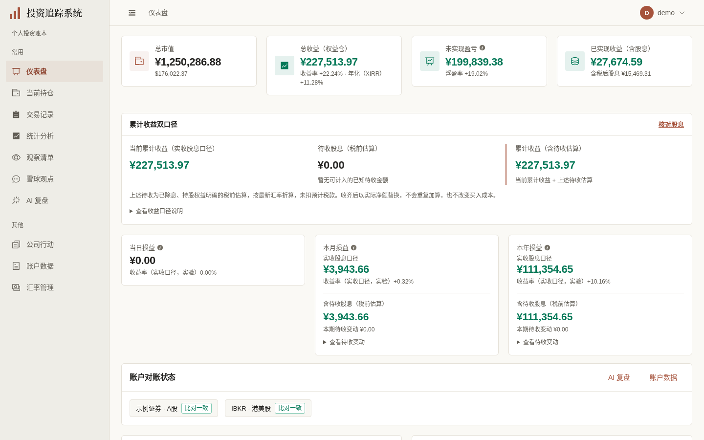
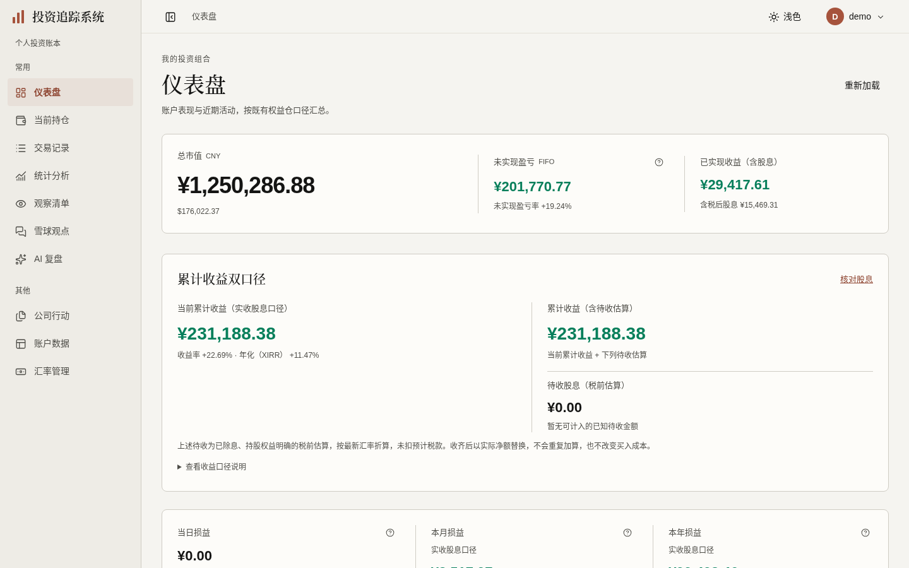
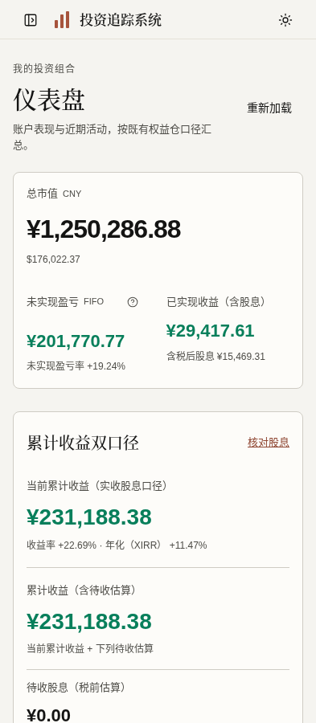

# 仪表盘阶段验收（2026-10-03）

依用户已确认的 [D4 与计划第21节（#415）](https://github.com/measimov/investment-tracker/pull/415)，本分支 base 为导航 `codex/navigation-shell-ui`（[PR #417](https://github.com/measimov/investment-tracker/pull/417)，92d4a2c）；只迁移真实仪表盘及其需要的共享待收/价格质量展示。其余页面后续独立推进，未合入、部署或关闭总体前端issues。

## 正式同数据前后图

专用 demo 库、虚构账本/行情；同一生产预览与 API，无付费研究调用。桌面1440×900 @1x，手机393×852 @2x；默认演示待收为0，不用它代替非零/未知状态验收。新图由 `frontend/demo/dashboard.spec.ts` 捕获；完整图与完成绘制的环图另留本机证据。

| 新导航下原仪表盘 | 新仪表盘 | 手机 |
|---|---|---|
|  |  |  |

## 财务来源与最小边界

- 保留同一 `portfolio-snapshot`、原单独 `period-pnl`、静默自动重读与刷新任务。没有业务算法、缓存、API或数据库变更。
- 市值CNY/USD、FIFO未实现/收益率、已实现收益/实收净股息、累计实收/待收原币/税前估算、月/年期初期末变动、XIRR及质量限制均保留。
- 仅移除同口径重复的顶部总收益卡：后端 `build_receivable_return`直接接`account_return.total_return_cny`，在已有待收卡现金口径显示原收益率/XIRR；缺summary时仍显示原总收益fallback。未知继续为—，真实零为0，不用估算替换实收。
- 市场图仍按既有 `markets.total_cost`（CNY兼容字段）绘制，保留异步按需加载/autoresize；本页补可见成本文字摘要、role=img名称与描述，逐市场缺汇率时明确仅含可折算部分，未新增持仓图或数据请求。
- 最近10笔与既有持仓深链保留；价格改用既有`formatPrice`并明示币种，0.085 HKD不被舍入为0.09。口径浮层内日期用`formatDate`，内容不改。

## 六维依据

| 维度 | 实际检查/结果 | 范围与限制 |
|---|---|---|
| 视觉与风格 | 暖表面、衬线标题，市值36/32px、累计实收/含待收28px、核对项24/22px；薄分隔而非重复图标卡。逐张查看桌面/手机/全页、缺汇率与非零部分待收样例；完成环图与表格对齐 | 统计使用共享待收卡仍保留22px，不提前升级统计页面 |
| 内容与财务可信度 | 独立与同demo API核对四主金额：市值¥1,250,286.88、FIFO未实现¥199,839.38、已实现¥27,674.59、累计实收¥227,513.97。现金累计只显示一次；月/年两端、received/possible_receipt理由、净额/币种待核实、legacy、缺FX、估算/不可估值均由已有E2E覆盖 | 状态样例是明确浏览器拦截的虚构fixture，未写真实股息或生产数据 |
| 任务与交互 | 价格质量原展开/刷新任务仍有效；原生查看明细按钮aria-expanded同步真实状态，Enter展开陈价/缺价名称通过。首次加载/失败未知/重试真零/再次失败保留上次数据、单独期间失败重试与缺summary fallback实际通过 | 刷新/确认业务函数复用，未新增任务或研究调用 |
| 响应式与可访问性 | 自查320/375/393/720/768/1024/1101/1440无整页横溢，金额完整；根独立320–1920共11宽与10位金额通过。FIFO/月/年说明在窄屏与展开侧栏真实键盘可达、四边不裁切；低频summary/说明/质量操作按本地尺寸保留24px桌面/44px手机。720×450 CSS px为200%等效重排。图表真实DOM名称/成本/缺FX描述已断言 | 不冒充literal浏览器缩放或读屏认证；近期交易保留表内横滚 |
| 性能与实现 | 同8笔demo、1440×900、生产构建、Chromium148、4倍CPU、5轮交替新context；snapshot和period各1次无重复；图表resize实测504→605→504，遵循本页reduced-motion偏好 | 双库过渡的实际JS增加见下表；不宣称换库全面提升性能 |
| 完整体验 | 加载/空市场/失败/真零、小价、部分待收/陈价/缺价与所有关键限制已实际检查。warning文字实测#875a21对暖底5.67:1；Naive placeholder公开token为#746f65，白底4.99:1/暖底4.74:1。不存在JS异常或外部请求 | 导航已交付#417；交易日期功能与交易视觉分别另开PR，未把本阶段等同全站完成 |

## 实际缺陷 → 修复 → 受影响复验

1. 顶部总收益与待收卡实收金额重复：去除仅同口径卡，rate/XIRR加局部可选props，无summary保留原fallback；后端来源核对与真实fixture通过。
2. 最近交易低价被两位金额格式舍入、说明裸ISO：复用既有price/date formatter；0.085 HKD和浮层日期回归通过。
3. 首次失败显示未知但图/表空态误作无数据、区间失败无状态：最小error标识与现有重新加载，首次显示暂不可用，已有数据保留并明确标记；初载→失败→重试→再次失败、期间独立失败回归通过。
4. shared warning橙色小字与选择占位提示太浅：只修两个待收组件文字色与公开`common.placeholderColor`，实际computed及背景对比通过；未改全局警告token或图表分类色。
5. 说明/原生details、价格质量和重新加载/错误重试操作触控尺寸偏小：局部24/44px、保留原生展开标记；真实键盘、aria-expanded与44px测量通过。
6. 环图过早截帧缺一段：独立稳定后展开/收起/回展开/滚动各约2.48万非透明像素，非持续空图故障；本页按reduced-motion关闭动画，正式capture等绘制完成后重拍。可见市场成本摘要与DOM图像名称已补齐。
7. 旧仪表盘字体测试依赖移除的卡片类；新共享28px误及统计：只更新仪表盘选择器/批准字号，把28px限定Dashboard调用，统计仍22px，最终二项通过；没有放宽其他财务断言。
8. 旧demo视频三处导航Element选择器断点：改真实原生链接，既有看板导览与完整演示都通过，无录制架构变化。临时配置仅留/tmp。

## 验证与性能

- API生成无漂移；Prettier、typecheck、418单元、生产build通过。
- 全量E2E104项初跑98通过/4按原条件跳过/2旧字体选择器失败；更新后受影响5项4通过/1统计共享字号失败，修正后字体二项通过；最终图表描述/待收受影响7项全部通过。合计覆盖100通过/4原跳过，不代表修后再次完整跑104项。远端clean CI结果在PR正文另行追加。
- 正式演示截图1项通过；既有看板导览1项、完整演示1项通过（只读研究tab/导入预览，不付费生成）。无backend、schema或迁移变动；前置#417已有完整双CI通过。

| 5轮生产短样本中位数/已加载资源 | 新导航+原仪表盘 | 新仪表盘 |
|---|---:|---:|
| 已加载gzip JS（含异步市场图资源） | 434981 bytes | 466529 bytes |
| FCP | 152ms | 152ms |
| 主金额就绪 | 662.2ms | 625.4ms |
| snapshot / period 请求 | 1 / 1 | 1 / 1 |

已请求JS增加31548 bytes（约30.8KiB/7.25%），是本页双库过渡的实际资源成本。`encodedBodySize`是本地preview的gzip口径，而非全站产物体积；5轮短样本、同机本地数据不能证明全站性能改善，未因此新增拆包框架。

采样发生在文字摘要、动态偏好与业务展示修复后，后续仅提升手机重新加载/错误重试的局部点击高度，未重复五轮。

本机证据：`/tmp/dashboard-ui-review/quality.json`（视口/computed/明确拦截样例/性能原值）；加载/错误/空市场截图为Dashboard E2E输出；`frontend/demo-output/dashboard/`完成绘制全图；独立`root-independent.json`、`root-chart.json`、`root-chart-settled.png`。正式可复现脚本、三幅图与关键E2E留仓，token/临时路径配置/大批近似图片/视频不入库。

本阶段无已知待修复缺陷，尚待最终独立记录审阅与远端CI。其他页面仍按已批准计划逐页推进。
