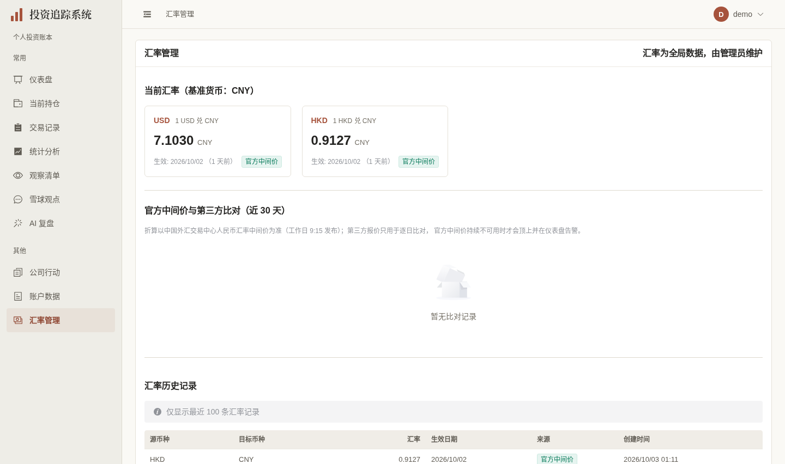
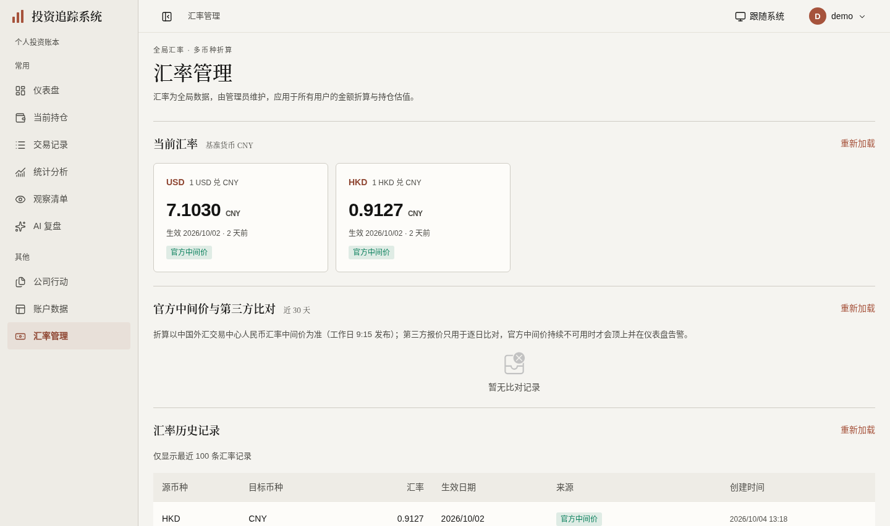
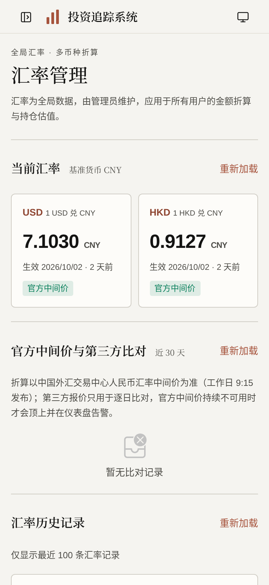

# 汇率页面展示验收（2026-10-03）

按[计划第32节](../FRONTEND_UI_UPGRADE_PLAN.md)，`codex/exchange-rates-ui` 基于观察[#427](https://github.com/measimov/investment-tracker/pull/427)的 `bbf350d2`。本轮仅页面展示、三类读取状态与历史成功范围标识、成熟手工表单的必要可达性修复。原API、全局汇率、写控制器、四位精度、折算算法与来源规则不变；未运行真实外部刷新或迁移。

## 同数据正式图

旧427预览与新版共享同一个专用虚构demo库，最新USD7.1030/HKD0.9127、历史100条、比对已成功确认为空。三API完整JSON相同；没有为拍摄新增汇率或比对记录。新版桌面1440×852@1、手机393×852@2，等待数据、字体及动画完成；正式捕获1项通过，两视口均无请求失败/JS异常/连接横幅。

| 旧汇率页 | 新汇率页 | 手机 |
|---|---|---|
|  |  |  |

## 已观察缺陷与最小修复

- 最新、历史和比对503均曾显示“暂无”。在各原读取函数分别保存成功/错误状态及只读GET重试；只有成功空结果表示真空。失败保留上次数据并说明未确认最新结果，不以失败伪造0或空。
- 历史include_inactive在慢/失败期间曾无法明确旧范围。保留原limit100与现有请求代次守卫，捕获调用参数，成功时才更新范围；提示上次是“仅生效记录”或“包含已停用”，旧成功/错误/finally都不能污染后续最新结果。其余两个读取同样直接复用现有useLatestRequest，无加载平台。
- 差异原手拼正号/百分号，沿既有formatPercent两位显示；汇率仍用formatNumber四位，strict绝对差异>2%才警示、7天陈旧和buildRateCards逐币种缺值逻辑均不改。
- 当前源只有每币种生效日期和比对official_date；完整保留工作日9:15发布说明，不增加“应发布日期”、推算或API字段。部分detail缺失/source null继续未知，不套顶层最新日期。
- 本页两个实际表格按feature拆为RateHistoryTable/SourceChecksTable，桌面薄行分隔及固定管理员动作，手机原位比对/创建明细。更新外部源按钮统一“刷新汇率”，与只读GET“重新加载”区分，handler不变。成熟ElForm/ElSelect/ElInputNumber/ElDatePicker/ElDialog及保存/停用控制器保留，仅补具名、mask保护、打开清旧校验和手机尺寸；日期展示斜线，ISO提交值不变。
- 正常图自查发现空态文字默认浅灰、真空比对仍渲染空表头与额外padding，局部用NEmpty公开textColor既有muted和零行分支修复。100条说明复用本页read-note正文，不改全局主题。

## 六维实际依据

| 维度 | 实际依据与结果 | 范围与限制 |
|---|---|---|
| 视觉与风格 | 暖白/暖灰/陶土、宋体标题、四位汇率主数字、逐币种日期/来源和薄表格行分隔；正常三图与压力图逐张查看 | 只本页实际显示，无主题/表格平台，不自评获奖级 |
| 内容与可信度 | 同demo三API完整JSON相同；合法虚构压力样例USD7.1234、HKD0.0851、EUR1.4090，个别detail缺失与source null不补齐；真零0.00%、±2.00%不警示、+2.01%警示、本地UTC23:30创建变次日保持 | 四位ratio不是金额；来源标色非金融方向色。无虚构生产字段/数据、无真实外部刷新 |
| 任务与交互 | 原管理员添加→编辑→停用、当前卡片联动通过；三读取503/分别重试/真空/旧数据、失败旧范围/重试恢复与迟到旧响应通过 | 原写流程仅独立E2E库；状态/乱序及根表单请求只浏览器虚构响应，演示无写入 |
| 响应式与可访问性 | 自查8宽、根10宽320–1920含640/641及720×450；body/document为viewport。手机比对与创建details真实Enter，具名原生停用筛选；桌面行操作24px/手机44px。普通用户真实Tab从历史reload进入库原生scroll区，ArrowRight后32px；根320/393/1440表单具名spinbutton/日期combobox、mask草稿、取消/Esc返回、手机四包装44px通过 | 720×450是200%等效CSS重排，非literal浏览器缩放；沿成熟库/原生机制，无DOM焦点补丁，不声称完整读屏认证 |
| 对比度与状态 | 空态最终rgb(95,91,83)在暖底约6.41:1；手工/陈旧标签合成白底4.90:1、降级5.49:1，实际computed核验；说明深色、未知值“—”；100条提示中性。错误与旧范围均明确可见 | 不改全局软文字或颜色规则；颜色测量等待原组件过渡完成，非首帧静态推断 |
| 性能与维护 | 同demo、1440×852、生产构建、4倍CPU、五轮交替：gzip JS288399→337679bytes；最终空态小修重采337687bytes，增加48.1KiB/17.1%。原三个取数请求路径一致 | 主要新增已有DataTable chunk58.8KiB，双库过渡成本，不新增拆包机制。FCP中位160→164ms、数据就绪1103.5→927ms仅本地短样本，不能推导真实手机/网络提升 |

## 同条件短样本

| 轮次 | 旧FCP(ms) | 新FCP(ms) | 旧数据就绪(ms) | 新数据就绪(ms) |
|---|---:|---:|---:|---:|
| 1 | 172 | 156 | 1103.5 | 984.7 |
| 2 | 168 | 168 | 1184.7 | 950.6 |
| 3 | 152 | 164 | 1106.4 | 927.0 |
| 4 | 160 | 168 | 1084.4 | 905.9 |
| 5 | 156 | 156 | 1095.1 | 852.3 |

计时在最后空态文字/表头与100条提示修正前完成，最后仅重采资源。请求相同：auth/me、exchange-rates/latest、exchange-rates?limit=100、exchange-rates/source-checks?days=30、auth/refresh（既有滑动会话续期）。临时配置、日志、凭据与压力fixture均不入库。

## 验证时点与残项

- 428单元（59文件）、完整E2E124通过/4既有跳过（workers=1），无失败或重试；3个针对原CRUD/失败/范围乱序回归先通过。最终空态小修后仅2个受影响状态回归及computed颜色/正式双图/资源复验；最后源按钮名称与100条说明改为既有read-note正文，仅检查真实名称/颜色、类型/格式/构建与截图资源，不拼总数或声称又跑完整门禁。
- 最终格式、类型、生产构建与OpenAPI重生成无漂移；生成组件声明无关删除恢复。无后端变更，不重复完整pytest。[#428](https://github.com/measimov/investment-tracker/pull/428) e05904f6完整远端CI37115201205已通过：后端3407/6跳过、428单元（59文件）、E2E124/4跳过，无失败或重试；用户已合入前序阶段后base改为main。随后仅正常同步已合入main的#426一行测试，当前head d209357，无汇率产品变化；新完整CI37117547240已通过：后端3407/6跳过、428单元（59文件）、E2E124/4跳过，无失败或重试；e059既有完整结果单列。
- 父#427 bbf350d2完整CI37113636368：后端3407/6跳过、428单元、E2E122/4跳过，无失败/重试。#426独立main-base一行测试已由用户合入，不夹入当前堆叠产品diff。
- 本机：`/tmp/exchange-rates-api-parity.json`、`exchange-rates-review.json`、`exchange-rates-keyboard.log`、`exchange-rates-contrast.json`、`exchange-rates-performance.json`、`exchange-rates-final-resources.json`、`exchange-rates-targeted.log`、`exchange-rates-e2e-full.log`、`exchange-rates-final-targeted.log`、`exchange-rates-demo-capture-final2.log`。根独立`exchange-rates-root-responsive.json`、`exchange-rates-root-state.json`、`exchange-rates-root-form.json`覆盖10宽、6类状态及三宽表单，外部/业务写/JS异常均零；虚构管理员UI样例不冒充后端权限证明；表单mock PUT严格仅{rate:0.0851}，卡片联动、编辑币种/日期只读、重开旧校验清除通过。
- 普通用户UI只读，实际后端管理员限制沿现有权限实现与门禁，未改变。账户、意见源、管理员页及来源能力D3继续独立推进，复杂表单保留成熟实现；总体#362/#367/#368/#369/#370/#353仍有残项，不关闭总体issue、不合入或部署。
