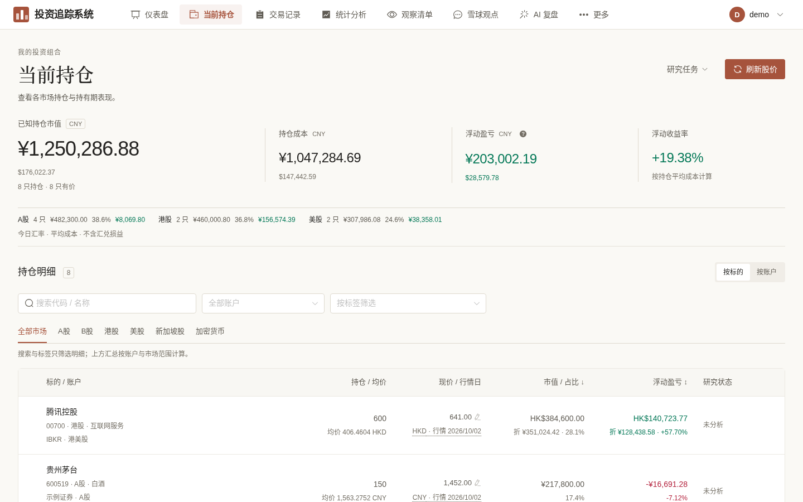
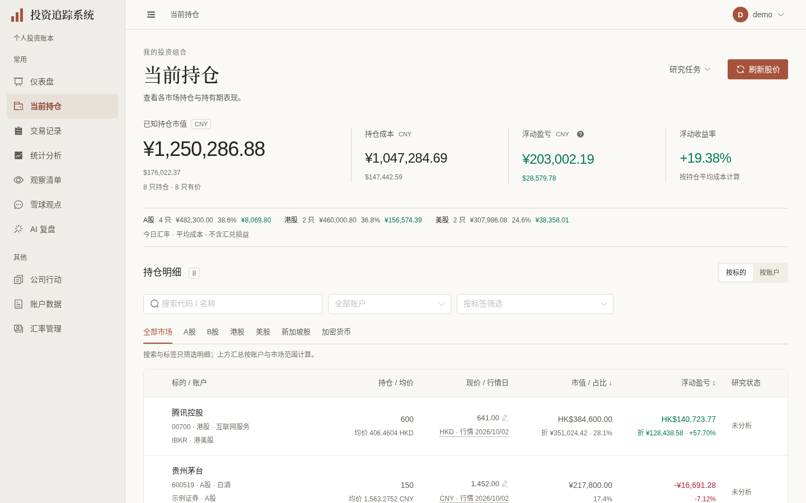
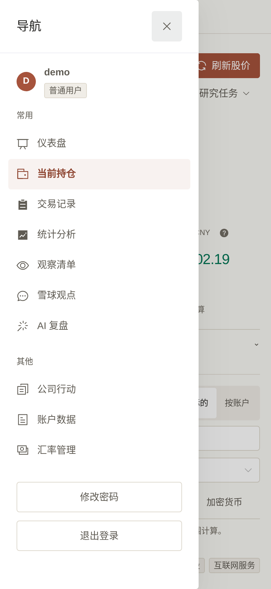

# 导航外壳验收（2026-10-03）

依据用户已确认的 [D2/D4 与下一阶段计划（PR #415，第21节）](https://github.com/measimov/investment-tracker/pull/415)，本分支依赖 [持仓试点 #416](https://github.com/measimov/investment-tracker/pull/416)，base 为 `codex/holdings-ui-pilot`。本次仅完成导航外壳及同源的两处操作浮层焦点缺陷；仪表盘和其余页面后续独立交付，未合入或部署。

## 同数据截图

全部使用专用 demo 库、虚构账本与行情，未调用研究任务。桌面 1440×900 @1x；手机 393×852 @2x。新版由 `frontend/demo/navigation.spec.ts` 可复现捕获；旧图由同一演示后端与 #416 生产预览捕获。

| 原顶栏 | 新左栏 | 手机覆盖抽屉 |
|---|---|---|
|  |  |  |

## 六维实际检查

| 维度 | 依据与结果 | 限制/后续 |
|---|---|---|
| 视觉与风格 | 暖灰224px左栏、暖白内容、陶土选中项；保持既有衬线页标题与数字层次。逐张查看桌面、手机和收起截图。实测侧栏小字改现有 muted 后灰底对比约5.76:1；选中项 primary-strong 在透明背景合成后约5.31:1 | 页面内容仍按已确认顺序逐页迁移，不自评赛事认证 |
| 内容与财务可信度 | 原10个普通/13个管理员入口、权限/meta.nav详情归属、账号认证、修改密码与任务状态保留。演示持仓8只、市值¥1,250,286.88、成本¥1,047,284.69与旧图一致；没有算法、API、缓存或账本改动 | 真实财务加载/缺失语义沿用 #416；未增加图表或任务 |
| 任务与交互 | 桌面224/0实际释放224px，跨路由/重载记住单一本地偏好；≤1100px独立默认关闭抽屉。普通/管理员入口、真实Ctrl新标签、会话切换、详情高亮通过；研究预览/确认/互斥/取消/进度回归7项通过，取消无任务POST | 研究请求均拦截样例，不触发付费任务 |
| 响应式与可访问性 | 1440/1280/1101/1100/1024/768/393/375/320 无整页横溢出；抽屉288px，Tab/Shift+Tab/Esc与返回开关、resize焦点、抽屉→既有密码Dialog通过。账户与研究入口使用普通 group 内原生按钮，Space/Enter/Tab/Shift+Tab/ArrowDown/Esc实际移动焦点；密码/确认取消回常驻trigger。720×450 CSS px等效200%重排；320/375/393及展开侧栏时说明/研究浮层四边均在视口内 | 等效宽度测试不冒充literal浏览器缩放；未宣称读屏认证 |
| 性能与实现 | 同8笔demo、1440×900、生产构建、Chromium148、4倍CPU、5轮交替新context。旧导航与新版收起时内容同宽；持仓请求均1次；ECharts异步按需加载保留，独立实际canvas宽540→652→540与侧栏响应一致 | 本地短样本，只支持本轮记录；双库仍存在，无性能全面提升结论 |
| 完整体验 | 详情/404/普通与管理员、登录/退出/改密/用户隔离、持仓宽表和窄屏、按需图表均实际验证；无JS异常或外部请求。原生href支持中键/新标签，未自建路由菜单/焦点/浮层框架 | 仪表盘状态与其他页面迁移在各自PR验收，不以外壳交付视为全站完成 |

## 观察 → 最小修复 → 复验

- 导航隐藏仍占宽风险：v-if移除左栏，内容margin直接224/0；真实boundingBox与重载/跨路由通过，断言等待渲染稳定，不加产品延迟。
- 抽屉关闭焦点可能抢密码Dialog：沿库after-leave再打开既有Dialog；真实Tab仍在Dialog内，返回导航开关通过。
- NDropdown Arrow键仅视觉pending，没有实际活动项焦点：账号及唯一另一处持仓研究入口改为内联NPopover、普通group和原生按钮；公开show同步aria-expanded，局部ArrowDown到首个可用按钮，Esc回常驻trigger。复用原确认/预览/禁用/任务函数，无通用键盘框架。
- 抽屉role=dialog但名称为空：仅加公开DOM属性aria-label="应用导航"；现有真实键盘回归新增getByRole按名称断言通过。
- 侧栏12px软文字、选中项透明灰底对比不足：只改本处现有muted与primary-strong，保留全局token；实际背景合成后通过。
- 手机页头额外4px裁切首笔标题：保持既有48px手机高度；最终393图第一笔信息可读，正文/金额未缩小。
- E2E旧Element菜单选择器失效：仅改真实navigation/link/button选择器，认证、用户隔离、财务断言不降级。新增测试任务mock过快结束错过运行禁用状态：测试在完成禁用断言后才放行完成，未改产品轮询。

## 验证与性能原值

- API类型重新生成无差异；Prettier、typecheck、生产构建、418单元通过。
- 全量初跑101项：96通过/4跳过/1旧菜单选择器失败；修复后受影响15项通过。新增研究操作后22项定向21通过/1上述mock时序失败，修复后7项研究回归全部通过。合计覆盖97通过/4既有跳过；这不表示修后又运行一次全量。完整clean结果以本PR远端CI为准。
- 正式demo捕获1项通过。临时配置仅在 `/tmp/navigation-demo-review.config.ts`，未引入项目配置或凭据。
- 最终原生操作/对比度修复后的生产版本采样（随后仅补抽屉aria-label，不重复性能采样）：已加载gzip JS旧375205、新354745 bytes（减少20460 bytes，约20.0KiB/5.45%）；FCP中位数均148ms；持仓8只就绪中位数旧683.4ms、新601.3ms。`encodedBodySize`口径含已请求JS，而非全站包大小，不能推广为全站性能改善。
- 本机原值 `/tmp/investment-navigation-review/final-quality.json`；独立导航/resize/chart复核 `/tmp/navigation-ui-review/results.json` 与 `resize.json`；正式截图脚本及核心E2E已留仓。

当前阶段无已知未修复缺陷。独立最终键盘/窄屏/颜色复核已通过；最后抽屉命名的定向复验通过，尚待远端CI；未部署、迁移或关闭总体前端issues。
