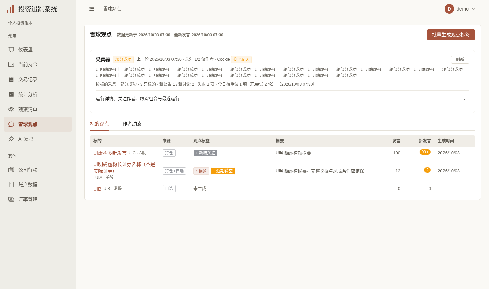
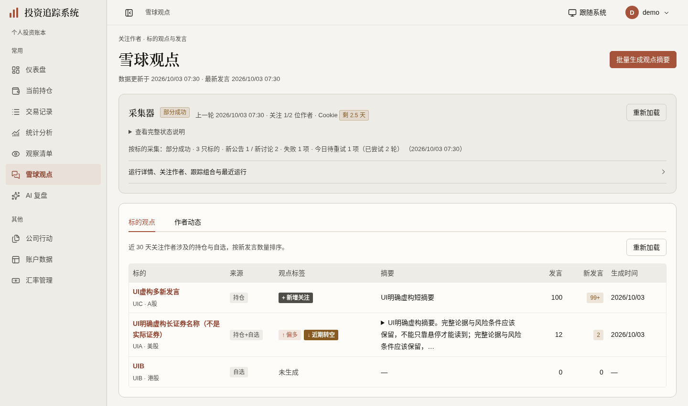
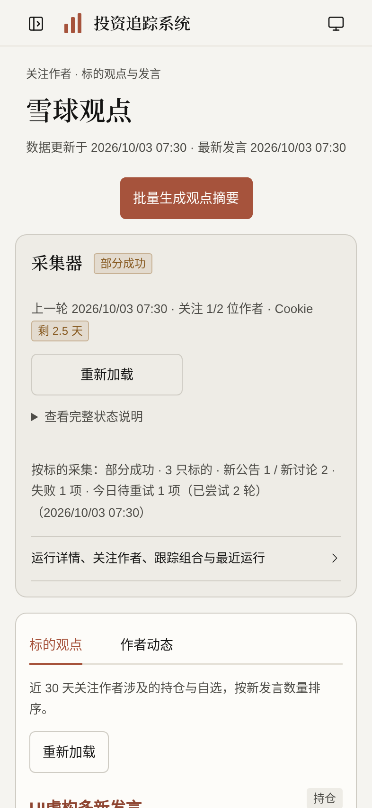

# 观点与采集器展示验收（2026-10-03）

按[计划第34节](../FRONTEND_UI_UPGRADE_PLAN.md)，`codex/opinions-ui` 基于账户[#429](https://github.com/measimov/investment-tracker/pull/429)的ae9c58d，正常快进继承其测试时区修复。仅展示和实际读取状态/代次；原API、数据源、任务/管理员写控制器、Cookie清理/文件代次/容量和格式限制不变。无模型、财务算法、迁移、真实采集或外部模型调用。

## 明确虚构正式图

演示身份来自专用demo库，观点/作者/采集器使用同一份[明确虚构只读fixture](opinions-ui-fixture.json)，不入生产或演示数据库。旧429预览与新版均用相同响应、上海时区和视口；1440×852@1、393×852@2。等待数据、字体及动画；最后capture1项通过，无请求失败/JS异常/连接横幅，所有外呼与业务写入阻断。

| 旧页 | 新页 | 手机标的 |
|---|---|---|
|  |  |  |

手机作者展开态：[正式图](mobile-opinions-authors.png)。完整发言及引用保留，187条总数与“显示最新2条”告知不变。

## 已观察问题与最小修复

- 概览503曾在错误条下显示“近期未提及”，采集器503仍显示“加载中”。分别在原读取维护成功/error，初次未知与真正成功空区分；旧数据刷新失败明确保留，并各自GET重试。采集器已有状态仍沿原health优先级，首次失败为“状态未知”。不建设加载平台。
- 初始sourceAvailable默认true曾无成功依据，作者200的source_available:false也曾被忽略并显示“没有发言”。初始概览能力为null，批量入口只在已知true时可操作；概览与作者各自保存来源/freshness，不能互相覆盖。来源false只说明本次不可用，不能断言从未接入；历史摘要保留。matched_count/new_utterance_count的null为—，真0仍0，100条新发言仍99+，原降序及近期变化标签保留。
- 作者A挂起→切标的tab→作者B成功后，旧A成功曾覆盖B，旧A503曾污染概览错误条。直接复用useLatestRequest分别保护概览/作者/采集器读取的成功、失败与finally；保留原feedLoaded成功缓存和请求参数。两类作者乱序根旧新对照通过，未改任务认领、轮询、取消/停止监看或付费参数。
- 标的采用必要Naive表格及手机读卡，真实RouterLink保留新标签/中键；完整长摘要原位details公开。采集器三实际列表局部CollectorRecords组件，原安全来源链接、名单、运行计数和完整错误保留；具名原生checkbox沿原权限/disabled条件。成熟ElTabs/ElCollapse/Descriptions/Cookie表单保留，不造菜单或ARIA机制。
- 长状态提示与100字摘要首版造成手机约12行提示/高表格行。长提示原位details，默认“查看完整状态说明”，原健康/上一轮/Cookie默认可见；短提示直读。长摘要默认48字且全文严格保留。共享OpinionAuthorFeed保留默认/换批收起、总条数及原发言/引用/时区，正文16px/1.8，并实际验证详情页首次懒读取与成功缓存。
- 最后真实输入自查发现四个NInput仅外层aria-label，实际input无名称；局部用公开inputProps传递，真实getByRole textbox/聚焦通过。Cookie原输入清理/不回显、默认probe:false、遮罩保护继续成熟实现，仅补本地名称/44px和占位对比。

## 六维实际依据

| 维度 | 实际依据 | 范围与限制 |
|---|---|---|
| 视觉与风格 | 暖白/暖灰/陶土、宋体页头、薄表格分隔、克制变化标签；四图逐张看，长说明/摘要与作者阅读分别自查 | 本页局部，无主题/表格/作者平台或获奖级自评 |
| 内容与可信度 | 相同合法虚构响应；降序/99+/null与0、原时间窗口、UTC23:30本地次日、完整摘要/发言/引用、187总数/2条截断、来源target/rel保持 | 虚构管理员标志仅UI场景，不冒充后端权限证据；无凭证回显或真实Cookie更新 |
| 任务与交互 | 原无来源与Cookie只读回归通过；根5状态、2类迟到作者响应、两宽Cookie严格mock单PUT/probe:false及失败清空通过；四输入真实可聚焦、输入不自动提交 | 原任务/管理写控制器不改；Cookie和管理写严格浏览器虚构响应，无真实采集/模型请求 |
| 响应式与可访问性 | 根10宽×标的/采集器展开/作者展开30几何态（高度852），另720×450三态无外层溢出；完整摘要/状态Enter、成熟作者折叠、原生具名checkbox、手机44操作通过；详情共享流首次懒读/再开不重拉/16px完整正文回归通过 | 另720×450为200%等效CSS重排，非literal浏览器缩放；未宣称完整读屏认证，沿成熟/原生机制 |
| 状态与对比度 | 来源未知/不可用与真正空明确；实际393/1440透明合成颜色全部≥4.5:1，最低“↑偏多”rgb166/83/60与白底12%背景约4.54:1 | 非红绿表达多空；不改全局token或后端availability语义，不提前D3隐藏 |
| 性能与维护 | 同fixture/视口/生产/4倍CPU五轮初样gzip JS270470→309025bytes；最后仅属性/文字修复后重采309076bytes，增加37.7KiB/14.3%，主要现有DataTable双库过渡成本。初始4GET路径与原版一致 | 本地短样本且其他验收并行；不据此推导生产全面提升，不因资源增量加拆包设施 |

## 同条件短样本

| 轮次 | 旧FCP(ms) | 新FCP(ms) | 旧数据就绪(ms) | 新数据就绪(ms) |
|---|---:|---:|---:|---:|
| 1 | 176 | 148 | 632.2 | 583.2 |
| 2 | 152 | 152 | 584.3 | 558.1 |
| 3 | 152 | 156 | 583.9 | 562.0 |
| 4 | 152 | 156 | 594.0 | 561.0 |
| 5 | 148 | 148 | 578.7 | 558.5 |

FCP中位均152ms，数据就绪584.3→561.0ms。五轮在末次长提示/摘要预览和inputProps修复前采样，最终只重采资源（比初样多51bytes），不重复或拼接计时。encodedBodySize为gzip口径。初始路径同为auth/me、xueqiu-collector/status、securities/opinion-summaries、securities/active-analysis-jobs，作者tab仍首次才发原feed GET。

## 验证时点与残项

- 428单元（59文件）通过。首5项定向3通过/2测试定位失败：负断言“没有发言”误匹配警告里的“不能据此判断没有发言”，精准限定真正空态完整文案，原产品未改；修后3项12.5s通过。原无来源与Cookie只读2项首次已通过。
- 完整本地E2E130通过/4既有跳过（4.1m），无失败/重试；该门禁在最后短summary文字和四个inputProps修复前。最后受影响4项定向14.0s通过，最终类型/格式/生产构建与API类型零漂移通过；无后端变更，不重复pytest。原0fa312e完整CI37121079421通过：后端3407/6跳过、428单元（59文件）、E2E131/4跳过，无失败/重试；这是下述P2修复前的历史证据，不代表覆盖了更新失败场景。
- 正式capture最后1项通过（5.0s）；最后inputProps仅影响管理员展开表单，正式demo普通用户默认图不含该表单，几何不变。生成组件声明无关删除已恢复，临时配置/日志/浏览器凭据不入库。
- 父#429首次73a9 CI126通过/1测试时区失败/4跳过历史保留；仅明确该spec上海浏览器条件后，当前ae9c58d完整CI37119431251已通过：后端3407/6跳过、428单元、E2E127/4跳过，无失败或重试。产品formatter无变化。
- 本机：`/tmp/opinions-targeted.log`、`opinions-targeted-final.log`、`opinions-input-final-targeted.log`、`opinions-unit.log`、`opinions-e2e-full.log`、`opinions-api-types.log`、`opinions-contrast.json`、`opinions-performance.json`、`opinions-final-resources.json`、`opinions-input-names.json`、`opinions-demo-capture-final.log`。根独立`opinions-root-before.json`、`opinions-root-state.json`、`opinions-root-responsive.json`、`opinions-root-race.json`、`opinions-root-final-short.json`、`opinions-root-inputs.json`、`opinions-root-reflow.json`、`opinions-root-cookie.json`与最后两宽Cookie记录覆盖上述状态/身份/阅读；所有外部/真实业务写/JS错误零。
- 成熟控件继续保留，未声称全站完全Naive。用户管理、管理员持仓/告警及独立来源能力D3继续各自PR；总体#362/#367/#368/#369/#370/#353仍有剩余项，不自动关闭、合并或部署。

## 远端P2：采集开关更新失败的显示纠正

[#430行内审查](https://github.com/measimov/investment-tracker/pull/430#discussion_r4173262991)和根393/1440只读复现 `/tmp/collector-toggle-root-before.json`：原作者/组合enabled=true，实际PATCH `{enabled:false}` 被模拟503后，原生checkbox的DOM先变false；row.enabled未变，同值GET重载也不能令Vue重写checked，管理员可能误以为已停用。此前完整131/4通过未覆盖此失败情形，不能替代本次实际回归。

仅CollectorRecords桌面helper和手机两处换既有NCheckbox公开受控checked/onUpdateChecked，仍以原row.enabled作为已保存事实。沿原isAdmin/saving并以同一条件声明aria-disabled，桌面24、手机44；手机可见“启用”保留在组件公开default slot，标准隐藏对象上下文保留完整可访问名称及文字点击区域。原toggleAuthor/toggleCube controller、PATCH端点/布尔body与成功GET重读不改，不补偿写、不建设状态或焦点平台。

实测 `/tmp/collector-toggle-controlled-proof.json` 两宽×两对象：503后与同值GET重载都保持true，全部写仅严格浏览器模拟、外部/JS错误零。原4项加新增393/1440两实际回归共6通过14.8s：失败/同值重载、随后Space成功false、挂PATCH时真实disabled且再次Space/click不多发、成功后再读true，原唯一enabled布尔payload保持。类型/格式/生产构建、428单元通过；新提交完整远端CI待完成，不与前述门禁拼总数。默认折叠正式图不含这三开关，图像几何未变；本机控制检查与日志分别为 `/tmp/collector-toggle-e2e.log`、`collector-toggle-typecheck.log`、`collector-toggle-format.log`、`collector-toggle-unit.log`、`collector-toggle-build.log`。生成声明无关漂移恢复，修后父链按正常merge同步431/432/37，不触及根工作区或真实名单。

最后slot调整后的两项新增真实回归12.1s通过；其间两次393测试因仍用无空格的旧精确辅助名称而失败，按实际“启用 作者/组合 …”修正定位，保留原失败/重载/忙时/Space断言，未改业务。之前6项14.8s与最后2项分开记录，不拼成完整clean。根 `/tmp/collector-toggle-root-fixed.json` 最后两宽8场景通过（失败true/false、成功与忙时、普通只读）；`/tmp/collector-toggle-root-label.json` 最后先scrollIntoView并量两处文字range均在视口，点击真实“启用”各触发一个严格模拟PATCH，503后仍checked。实际手机60×44、桌面24×24；外部/真实写/JS错误零。最后类型/格式/构建与API类型零漂移通过，单次资源 `/tmp/collector-toggle-resources.json` 309138gzip bytes，仅比旧正式交付309076多62bytes；不替换旧五轮计时或推导性能提升。默认正常截图 `/tmp/collector-toggle-default-desktop.png` 已查看，无错误横幅，默认折叠无三开关展示变化。末次日志 `collector-toggle-label-e2e-complete.log`、`collector-toggle-typecheck-final.log`、`collector-toggle-format-final.log`、`collector-toggle-build-final.log`。

7696c4d最新完整CI37127663968：后端3407/6跳过、428单元59文件，E2E132通过+1重试通过/4跳过；既有app.spec.ts单账户改价用例首轮期待12.3456却得到0，重试通过，此head不能称clean。该金融读取/用例同步原因另作实际退出调查，不混入告警页或修改正确性断言。
