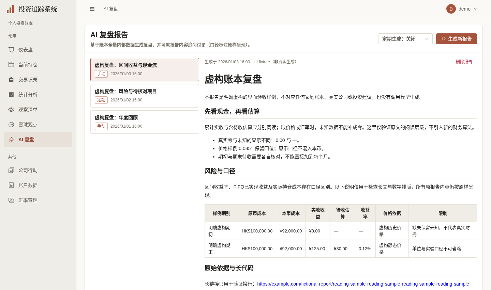
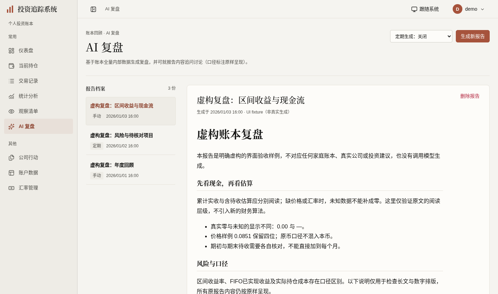
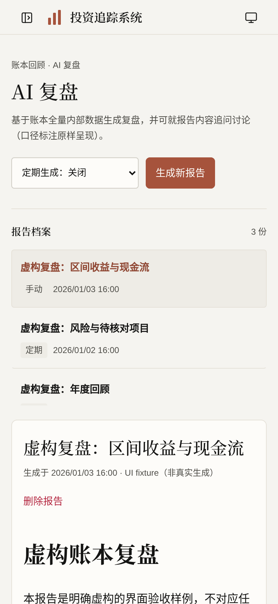

# AI 复盘阅读展示验收（2026-10-03）

依据[计划第29节](../FRONTEND_UI_UPGRADE_PLAN.md)。分支 `codex/reports-reading-ui` 基于 [#423 研究阅读](https://github.com/measimov/investment-tracker/pull/423) 最新 `4778a5e`；依赖未合入时以研究分支为base，仅审阅本页差异。取数、生成job、轮询、追问、删除确认和定期保存接口保持，未增加报告/模型功能、API或数据库迁移。

## 同输入正式图

使用[明确虚构的复盘fixture](reports-reading-fixture.json)：3份虚构报告、原口径说明、长表/URL/代码和虚构追问回答，仅浏览器拦截，不写演示账本或调用模型。旧研究分支与新版使用同一演示身份及同样输入。桌面1440×852 @1x、手机393×852 @2x，等待字体、请求及动画后捕获最终生产构建；既有真实研究截图不替换。

| 旧复盘 | 新复盘 | 手机 |
|---|---|---|
|  |  |  |

具名 `demo:capture` 步骤沿用既有登录/等待，真实调用1项通过；断言没有pageerror、请求失败、连接横幅或报告写入。隔离预览4184配API18106，CORS允许实际origin，未使用错误态图冒充正常态。

## 已观察缺陷与最小修复

- B详情503前仍显示A正文、可追问/删除A；切选立即清旧详情，只显示所选报告的成功结果，失败可只读重试，相关动作不呈现。原五项追问/详情/删除后失败回归保留。
- A1挂起→B→A2成功→A1晚到曾覆盖最新A2。直接复用已有 `useLatestRequest` 守卫该装载函数成功、错误和finally，不引入请求平台；列表及配置的局部重试沿相同已有机制。
- 初载列表503不再显示“暂无报告”，配置503不把默认off当成已关闭；已知空列表才引导生成。定期有限选项为具名native select，初载/保存期间禁用，显式保存失败保持未知再复用原GET回读，不默认启用定期生成。
- 原列表div改真实button与aria-current，原生成和删除函数复用；破坏性确认公开文案为“删除/取消”。Naive loading实际DOM仍enabled，自查后生成/追问同时绑定原generating/asking的disabled，保留互斥与输入禁用，不建设自定义键盘机制。
- 本页正文16px/1.8、最大80ch，长URL换行、PRE局部横滚。窄屏8列表格曾被压成不可读窄列，仅本页单元格最小96px保持可读及原生局部滚动。marked/DOMPurify与财务原文、四位小数、未知/零、风险/实验口径均原样保留；无Markdown抽象或新包装层。

## 六维实际依据

| 维度 | 实际依据与结果 | 范围与限制 |
|---|---|---|
| 视觉与风格 | 暖白/暖灰/陶土、沿已认可宋体栈的AI复盘页头与报告标题、薄分隔、桌面档案/阅读两列和手机完整正文。正式前后/手机及长文完整图逐张检查，实际正文16px/28.8px | 不自评获奖级；手机列表限高保留内部滚动，内容不截断成悬停提示，不缩小金额/正文 |
| 内容与可信度 | 旧/新同虚构报告原文相同，FIFO/区间/待收估算说明、0.0851、未知与真零保持；原角色/时间/模型/消息内容保留。script和javascript href实测仍净化 | 没有编造家庭账本事实或真实模型输出，fixture不入库；没有财务计算、精度舍入或数据语义变化 |
| 任务与交互 | 初载双503独立只读重试、B挂起/失败期间无A可操作正文、B重试与ABA最新结果通过。原慢追问不跨报告/失败草稿保留及删除后列表失败回归通过。实际Enter生成只模拟1次POST，期间禁用，job成功选返回报告；定期显式monthly及失败回读monthly通过 | 全部付费/配置修改只浏览器mock，未运行真实生成、追问、定期任务或外呼；原2000字限制实测2100截2000 |
| 响应式与可访问性 | 自查8宽320–1920及根8宽，body/document等于viewport；长title/URL、30份列表及正文完整。真实报告按钮Enter/aria-current、具名native combobox/textbox、宽表/PRE焦点+ArrowRight通过；手机常用按钮/选择器均≥44px | 720×450为200%等效CSS重排，非literal浏览器缩放；采用原生/成熟组件焦点机制，不宣称完整读屏认证。只有实际溢出的表/代码才需要滚动焦点 |
| 对比度与状态质量 | 实际背景alpha合成采样小字/标签最小4.995:1（字数提示）；可见输入占位层为rgb(116,111,101)，对白4.995:1。未知、加载、成功空、失败与旧列表分开；同一生成/追问状态绑定loading及disabled | 原公共暖色主题复用，未新增主题机制；采样结论限本页实际状态。列表刷新失败明确标上次成功结果，不能冒充当前完整列表 |
| 性能与可维护性 | 同fixture、1440×852、生产构建、4倍CPU、五轮交替：初始gzip JS244814→232493bytes；末次disabled小修重采232475bytes（较旧-12.0KiB/5.0%），5个API路径不变。FCP中位160ms相同，正文就绪654.1→606.3ms | 本地五次短样本不能推导真实网络/手机或全站性能；计时早于最后两disabled props，最终仅重采资源。无新依赖、拆包框架、状态平台或财务改写 |

## 同条件短样本

| 轮次 | 旧FCP(ms) | 新FCP(ms) | 旧正文就绪(ms) | 新正文就绪(ms) |
|---|---:|---:|---:|---:|
| 1 | 180 | 168 | 698.7 | 606.3 |
| 2 | 160 | 160 | 633.6 | 598.4 |
| 3 | 160 | 160 | 622.1 | 607.6 |
| 4 | 160 | 160 | 659.3 | 614.9 |
| 5 | 180 | 160 | 654.1 | 603.5 |

## 验证时点与残项

- 格式、类型、最终生产构建通过，OpenAPI重新生成无漂移；428项单元（59文件）通过。没有后端改动，本页不重跑完整pytest。
- 初次8项报告定向6通过/2失败，均为同文案inline与全局通知的严格定位歧义；收窄到实际列表/正文区域后8通过，原运行与断言不放宽。随后与CI同workers=1完整E2E117通过/4既有跳过，无失败或重试。
- 完整运行后仅生成/追问公开disabled属性修正，受影响8项定向再次通过；真实Enter生成互斥、四宽颜色/尺寸/正式capture再通过。没有把全量加定向总数当成最后修改后的全量clean。已交付[#424](https://github.com/measimov/investment-tracker/pull/424)，最新3a7b1638完整远端CI37109880415通过：后端3407/6跳过、428单元、E2E117/4跳过，无失败或重试。
- 父#423首提交6174202完整远端CI37108036514：后端3407/6跳过、428单元、113 E2E/4跳过，无重试；最新4778a5e CI37108720295后端3407/6跳过、428单元、113 E2E通过+1项重试通过/4跳过。该重试是既有Dashboard测试关闭浮层只等待hidden、离场DOM与下一浮层同时匹配，另开独立测试小PR等待DOM移除；未混入本页运行逻辑或测试。
- 后续三处成熟表单遮罩保护、观察/汇率/账户/意见源/管理员余页以及单独来源能力D3继续依计划独立推进。#362/#367/#368/#369/#370/#353总体仍有未验收项，未合入/部署或关闭总体issues。
- 自查本机证据：`/tmp/reports-reading-review.json`、`reports-reading-controls.json`、`reports-reading-contrast.json`、`reports-ui-performance.json`、`reports-ui-aba-final.json`；完整`reports-e2e-full.log`、最后定向`reports-e2e-last-targeted.log`、拍摄`reports-demo-capture.log`。根独立`reports-reading-root-state.json`、`reports-reading-root-responsive.json`与`reports-reading-root-task.json`（queued/running/succeeded、trim追问、取消零DELETE与明确删除1次，全部严格浏览器模拟）。临时脚本/凭据/日志不入库，正式三图及明确虚构fixture随PR保存。
