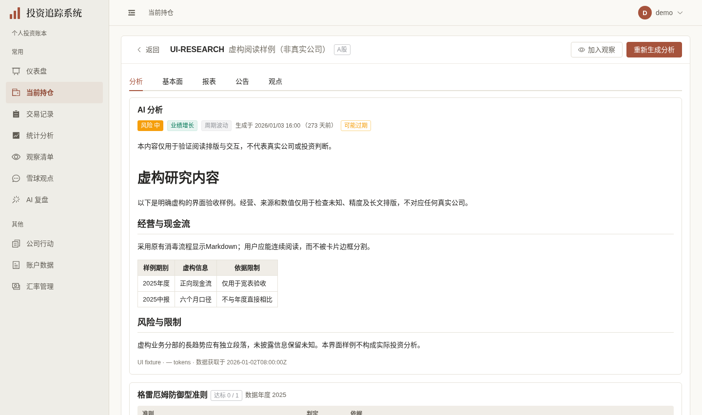
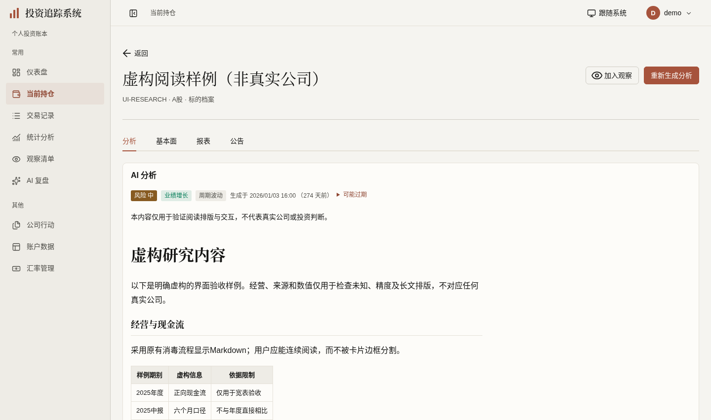
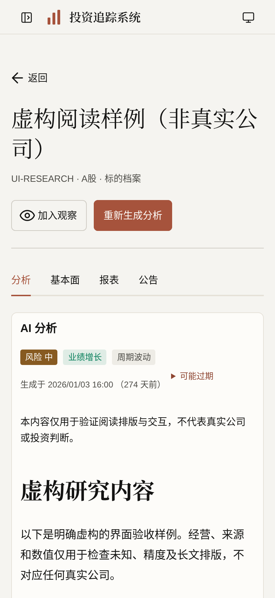

# 研究档案阅读展示验收（2026-10-03）

依据[已确认计划第28节](../FRONTEND_UI_UPGRADE_PLAN.md)。分支 `codex/research-reading-ui` 基于 [#422 公司行动展示](https://github.com/measimov/investment-tracker/pull/422) 最新 `9521c5fd`；依赖未合入时以公司行动分支为base，仅审阅研究阅读差异。本轮保留原取数、生成/补录任务、财务计算和Markdown消毒，不改API、迁移、模型、来源权限或真实账本。

## 正式图与虚构样例

现有600900演示资料为空，不能为真实公司编造报告。本轮使用[明确虚构的UI-RESEARCH样例](research-reading-fixture.json)，名称及内容标注“虚构阅读样例（非真实公司）”，仅浏览器拦截GET用于拍摄/回归，不导入数据库、不调用模型。旧版与新版使用同一演示身份及相同样例。桌面1440×852 @1x、手机393×852 @2x，等待字体、请求和动画稳定；既有真实公司截图保持原样。

| 旧研究阅读 | 新研究阅读 | 手机 |
|---|---|---|
|  |  |  |

`demo:capture` 增加一个具名样例拍摄步骤，并沿用既有登录与截图函数；实际命令定向通过，并断言无pageerror、失败请求及连接错误横幅。临时4183拍摄端口未被18100的CORS允许曾误捕获错误提示，最终改用已允许的4182/18105重新拍摄；没有隐藏错误或改应用CORS。样例包含长正文、趋势、未知/真零、港股EPS 0.0851、6M、中报、币种变化、Yahoo兼容来源、财报疑点与美股普通股/非ADS说明，不代表真实公司事实。

## 已观察缺陷与最小修复

- 分析503先前被当404“暂无分析”。现在仅分析接口404表示已确认尚无分析；其他失败保留未知或此前同标的数据，分别提供分析/资料只读重试。原路由请求代次守卫保持，A→B→A的旧失败不能污染A的最新成功。
- 首载资料、失败、真实空与缓存刷新分开呈现；缓存资料刷新期间保留子组件，避免同标的任务刷新/重试重建年报和中报开关。跨标的开关不保留，与旧版真实同业导航行为一致。
- 未登录直达→登录→详情的上一页是Login，原返回再次被守卫送回详情。仅此情况复用直达fallback返回持仓，正常历史仍router.back；不改登录全局行为。
- 正文原全局P/LI规则实际覆盖为14px，现仅本页16px/1.8、最大80ch。长代码原被Tabs裁剪且无法滚动，现本页PRE局部横滚；Markdown解析/DOMPurify不变。财务表数字不缩小、不拆分小数。
- 财务摘要原文链接Enter冒泡到折叠标题，现原生a局部阻断keydown传播，保留Enter打开、target/rel；鼠标和键盘均不误展开。真实同业RouterLink保留Ctrl新标签。
- 观点503先前同时显示无观点，现失败与成功空分支互斥并复用原只读重试。公告/观点过滤、懒首次、作者/标的feed按需展开及生成互斥保留；不主动生成研究或抓取外部源。
- 财务render仍使用原helper、空值/阈值/分组/币种逻辑；证券事件标签复用既有securityEventTypeLabel，资料采集脚注复用formatDateTime。桌面移开鼠标后H1底色实测rgb(248,247,243)，✕/雅/修正/换币说明保留，辅助信息使用可键盘展开的本页native details。

## 六维实际依据

| 维度 | 实际依据与结果 | 范围与限制 |
|---|---|---|
| 视觉与风格 | 暖白/暖灰/陶土、衬线页头、薄分隔、16px/28.8px阅读正文和等宽数字。逐张检查正式前后/手机及五tab完整图；长引用、趋势和来源默认内容不被截断 | 沿获认可方向，不自评获奖级；长表与代码局部滚动，不压缩字号或删原内容 |
| 内容与可信度 | 港美同一虚构输入前后完整单元格/原币/单位相等；HK EPS0.0851、✕、2.00雅、6M、美股FY排除Q3及普通股/非ADS说明保留。真实零、未知和404已知无分别验证，Markdown script/javascript href仍消毒 | 没有编造真实研究或改变财务算法；虚构fixture不进入生产；原估值、拆股、数据修正解释保持 |
| 任务与交互 | 503→独立只读重试→404、A/B/A过期失败、同标的任务刷新保持中报开关通过。五tab首次/常驻实例与details打开状态保留，未展开feed零请求；深链/正常返回/登录返回均通过；原文鼠标/Enter不误展开，同业Ctrl新页通过 | 任务回归使用已有隔离E2E及明确浏览器模拟；视觉检查不外呼模型、不写账。原生成/后台进度/停止轮询控制器保持 |
| 响应式与可访问性 | 自查与根复验8宽×5tab共40状态，整页无横溢。6类宽表及Markdown表/PRE真实焦点+ArrowRight滚动；成熟ElTabs方向键、native筛选/summary、手机常用按钮/开关44px、来源链接44px通过。720×450弹性重排可读 | 720×450是200%等效CSS宽度测试，非literal浏览器缩放；实际DOM/键盘验证，不宣称完整读屏认证。宽表保持局部滚动 |
| 对比度与状态质量 | 实际前景/透明背景合成检查最小4.544:1（偏多标签），本页采样小字/风险/观点/未知/空态均不低于4.5；手机采样控件无低于44px。风险等级及非财务观点色分开，真空不与失败同时出现 | 仅本页局部标签/文字，未改变全局分类色；对比度结论限实际采样，不等同全站认证。提示以native details呈现，避免新的定位框架 |
| 性能与可维护性 | 同样例、1440×852、生产构建、4倍CPU、五轮交替；采样初始gzip JS317186→344879bytes，最终小修构建再采346089bytes（+28.2KiB/9.1%），仍相同5个API路径。FCP中位160→152ms，正文就绪630.0→612.5ms | 双库过渡资源实际增加；短样本不推导真实网络/手机或全面提升。时间采样早于末次样式/公开props/链接边界小修，最终仅重采资源；无新依赖、表格/主题/状态平台 |

## 同条件短样本

| 轮次 | 旧FCP(ms) | 新FCP(ms) | 旧正文就绪(ms) | 新正文就绪(ms) |
|---|---:|---:|---:|---:|
| 1 | 216 | 172 | 817.6 | 658.8 |
| 2 | 160 | 196 | 630.0 | 673.3 |
| 3 | 152 | 148 | 668.6 | 612.5 |
| 4 | 168 | 152 | 608.6 | 564.8 |
| 5 | 156 | 152 | 578.3 | 562.4 |

## 验证时点、真实例外与残项

- 428项单元（59文件）通过，含分析404/503与旧失败不污染的实际回归；标签复用后既有标签7项定向通过。格式、类型、生产构建通过，OpenAPI重新生成无漂移；没有后端改动。
- 首轮默认多worker完整E2E110通过/4既有跳过/3失败：两项旧Element定位随真实控件更新；另一项原持仓价格API断言与并发CRUD用同一个全局EDT001报价竞争。三项单worker定向全部通过，金融断言及产品逻辑未放宽。随后按CI相同workers=1完整113通过/4既有跳过，无失败或重试。
- 该完整运行之后，最终缓存实例保留、链接Enter边界、共享标签及局部CSS修正再定向14项研究/任务回归全部通过；没有把全量和定向合计当作最终全量clean。具名虚构demo拍摄1项实际通过。首提交6174202远端完整CI37108036514通过：后端3407/6跳过、428单元、113 E2E/4跳过，无重试。最新4778a5e完整CI37108720295通过：后端3407/6、428单元、113 E2E直接通过+1项重试通过/4跳过；不能称为无重试。
- 父#422最新9521c5fd完整远端CI（37104537002）为后端3407通过/6跳过、426单元、110 E2E通过/4跳过，无失败或重试；此结果不替代本PR远端验证。
- ElTabs及摘要/观点ElCollapse继续成熟懒加载、键盘与常驻能力；共享作者feed/Xueqiu列表保持现有实现。本轮仅迁移实际触及展示控件，未声称移除全站Element。来源能力D3、Reports、三个成熟表单遮罩保护及其余页依计划分别推进，总体#362/#367/#368/#369/#370/#353仍有未完成项。
- 提交后根浏览器发现质押/股东增减持/解禁三个缺比例拼出“—%”。仅在原formatPct/formatFixed返回已知字符串时追加百分号，未知—、真零0.00%和股东0.1234%分别通过新增一条真实浏览器回归；原股东2–4位精度保持。本补提交仅局部显示与该回归，正式默认图无这些风险数据，不重拍；最新4778a5e完整CI结果见上条；重试为原Dashboard浮层离场DOM测试时序，另开独立小测试PR等待DOM移除，不改业务或金融断言。
- 自查临时证据：`/tmp/research-reading-self-review.json`、`research-reading-final-controls.json`、`research-reading-contrast.json`、`research-pre-review.json`、`research-ui-performance.json`、`research-reading-formal-capture.json`；完整运行`research-ui-e2e-final.log`、末次定向`research-ui-e2e-last-targeted.log`、拍摄`research-demo-capture.log`。
- 根独立临时证据：`/tmp/research-reading-root-state.json`、`research-reading-root-navigation.json`、`research-reading-root-responsive.json`、`research-reading-root-financial-parity.json`、`research-reading-root-markdown-scroll-final.json`、`research-reading-root-links.json`、`research-reading-root-peer-filter.json`。脚本/运行输出/凭据不入库；正式三图和无凭据虚构fixture随PR保留。
