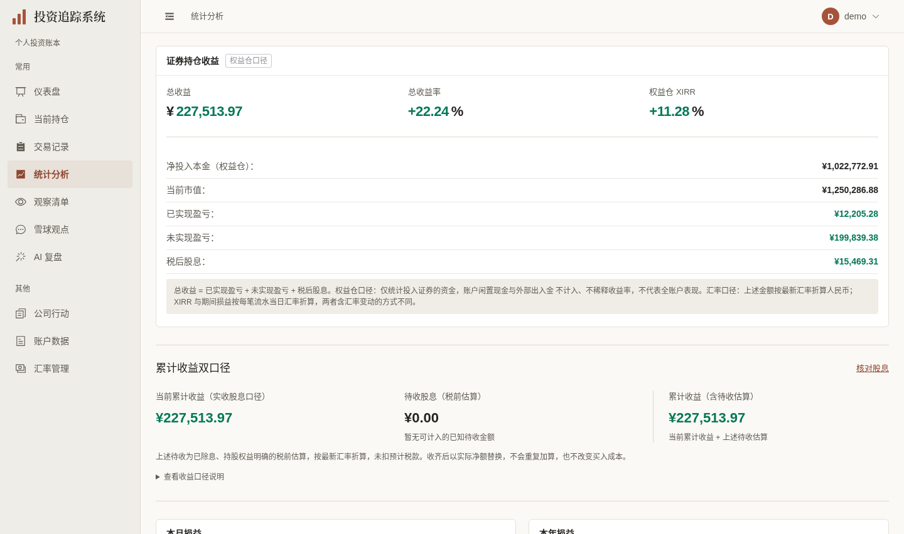
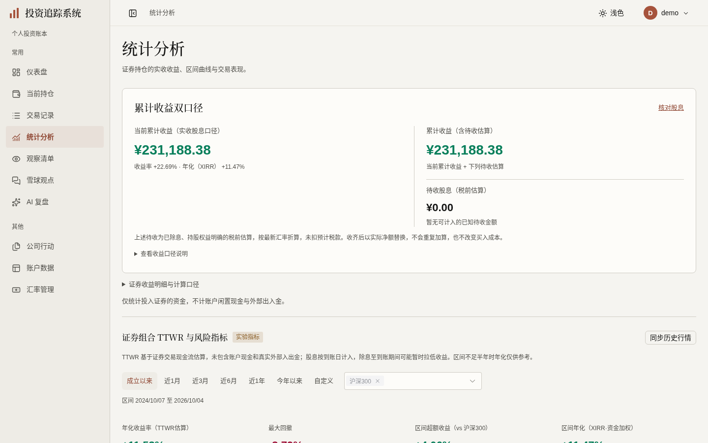
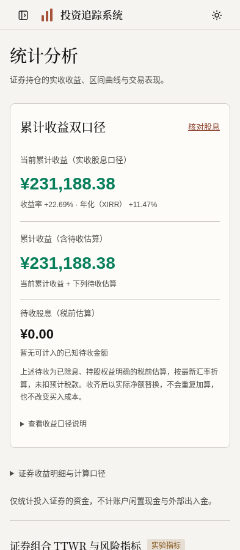

# 统计展示阶段验收（2026-10-03）

依据[已确认计划第25/27节](../FRONTEND_UI_UPGRADE_PLAN.md)，分支 `codex/statistics-ui` 基于用户已合入415–420的 `main`（ad5e0aee）。本轮改善统计页层级、现有控件与真实失败状态；不改财务算法、API、缓存、数据库迁移或历史账本。

## 同数据正式图

同一独立虚构 demo 账本，未重灌或保存报价，外部凭证与周期任务关闭。基线为已合入交易界面上的旧统计页；桌面1440×852 @1x，手机393×852 @2x。等待字体、请求及图表绘制完成后捕获最终构建，完整图及特殊状态仅保留本机。既有 `demo:capture` 删除失效的统计卡片选择器，并加入手机统计截图；没有新拍摄框架。

| 旧统计页 | 新统计页 | 手机 |
|---|---|---|
|  |  |  |

## 保留事实与实施边界

- 累计实际收益与含待收税前估算并列；前者与原权益摘要的总收益为同一服务端字段来源，复用已有收益率/XIRR后去掉重复KPI。权益明细、峰值投入分母和证券资金范围仍可读；缺少待收摘要时原KPI回退。未知、真正零、原币/CNY/USD、FIFO与实际买入成本、月/年期初期末待收差额保持各自口径。
- 区间与主要曲线结果前移，仍为原实收TTWR/XIRR。十二项指标、SHIBOR、样本数、基准原币/不含股息及实验说明保留；夏普旁重复的不可聚焦图标删除，正文已有完整解释。文案使用“刷新价格”“未实现盈亏率”“已实现收益（含股息）”“获利因子（Profit Factor）”。
- `FinancialStatistic` 仅改展示为语义元素，仍由原格式化函数判未知。真实调用者完整使用 `formatCurrency`/`formatPercent`，避免分离币种/负号；图表金额也直接用同一helper。两个市场成本饼图使用同一分类色板，不用盈亏红绿作分类。
- 实测 Naive 多选基准关闭时焦点元素无名称/角色，打开后活动项也缺少公开关联；本处保留成熟 `ElSelect` 的具名combobox与option语义、三项上限及删除重选。实际满三项搜索第四后曾误取消隐藏的旧项；公开 `default-first-option` 修复，第四disabled时Enter不改查询，无匹配也不改已选。没有自制ARIA或键盘框架。
- 交易与统计是两个真实日期调用者，仅抽取现有局部 `DateRangeDialog`，继续首次打开异步加载、NModal焦点管理、公开DatePicker panel及ISO查询；取消/Esc不应用草稿。实际历史custom→成立以来→再次打开取消曾自动查询旧区间，修为只有应用才写custom状态，原watch机制不变。
- 价格弹窗直接绑定原 `usePriceInputs`。四位输入、取消、清空、试算/保存区别不变，遮罩不关闭。真实无名步进/清空按钮通过公开参数关闭；方向键步进、全选Delete空值仍正常。公开 `close-focusable` 使默认具名close可Tab/Enter关闭；取消/Esc/关闭均由库返回原触发器。
- analytics和三个分布块只在现有装载函数增加必要成功/失败状态与最新请求保护；首次失败显示未知，真实空成功才为空，换范围失败保留旧结果并标明其原区间/分组。基准目录失败有只读重试，搜索无匹配不误报目录失败。没有状态平台、额外请求或新依赖。

## 六维实际依据

| 维度 | 实际依据与结果 | 范围/限制 |
|---|---|---|
| 视觉与风格 | 暖白/暖灰/陶土、衬线标题、阅读式累计金额和薄分隔；曲线先于FIFO/股息/分布。逐张检查正式首屏及绘制完整的长图，现金累计去重、日期和四位成本列可读 | 沿获认可方向，不自评获奖级；下方风险明细默认展开，关键信息未隐藏 |
| 内容与可信度 | 根独立8宽的summary、period-pnl、analytics完整JSON与基线相等；默认现金累计¥227,513.97，实收/估算、月年调整和XIRR保持。既有待收/缺汇率/未知税回归通过；浏览器拦截另检查部分待收、历史未核验、NET_ONLY和十位负金额 | 特殊状态明确为虚构fixture，不写账本、不补财务事实；成本表保留原币/CNY、账户及数量/价格各自精度 |
| 任务与交互 | 最多三基准的真实键盘添加/满额阻止/删除重选/无匹配通过；日期无效与反向阻止、应用一查询、历史custom取消无查询。价格0.0851保留，计算严格三个只读POST均200，退出恢复原累计；取消/遮罩不写入 | 原保存函数及既有隔离E2E保存流程保留；演示检查不点击保存、不触发历史同步外呼 |
| 响应式与可访问性 | 自查9宽320–1440，根8宽320–1920页面等于视口；320/375/393/720×450/768/1024/1101/1440基准、日期和价格四边通过。具名基准/价格输入、活动option、原生details、Esc/Enter焦点返回、排行region方向键横滚及侧栏释放224px图表autoresize成立；所有图表有真实文字摘要，尊重减弱动态 | 720×450为200%等效CSS重排，非literal浏览器缩放；验证实际DOM与键盘，不宣称完整读屏认证 |
| 对比度与状态质量 | 小字沿用muted/暖底；实际实验warning标签文字#875a21、背景按alpha合成后4.67:1；缺FX/历史/未知税及NET_ONLY正文实测14.19:1或以上，部分待收提示默认可见。初载失败不冒充0或空，刷新失败保留并说明旧结果身份 | 只修真实调用点，不扩全站token/ARIA框架；禁用态仍使用成熟组件机制 |
| 性能与可维护性 | 同demo、生产构建条件五轮交替新context，初始gzip JS497857→460028bytes，减少37829bytes；FCP中位152ms相同、曲线canvas就绪1029.4→811.1ms。最终小文案/公开控件参数后单次资源复核459969bytes、仍12请求 | 本地4倍CPU短样本，不推导真实网络/手机性能或全站改善；双库与成熟Element基准/通知/任务进度仍保留，无拆包平台 |

## 性能原值与限制

Chromium，1440×852、同虚构账本与静态行情、CPU4倍、减少动态，五轮新context交替测量。`encodedBodySize` 是gzip响应体，曲线就绪指canvas出现，并非所有交互就绪。采样在核心业务/样式完成后、最终术语/重复图标/公开输入参数调整前；最终资源单次复核减少了另59bytes，时间样本不冒充最终重新五轮测量。

| 轮次 | 基线FCP/曲线就绪（ms） | 新版FCP/曲线就绪（ms） |
|---|---|---|
| 1 | 172 / 1038.7 | 152 / 811.1 |
| 2 | 152 / 1007.0 | 148 / 946.4 |
| 3 | 168 / 989.5 | 152 / 789.3 |
| 4 | 152 / 1133.9 | 152 / 790.5 |
| 5 | 148 / 1029.4 | 152 / 870.8 |

五轮减少约36.9KiB/7.6%，最终单次初始资源459969bytes。收益曲线与两个分布图仍异步ECharts，日期只有首次打开加载；未改bundler、缓存或取数设计。

## 检查与独立复核

- 格式、类型、生产构建通过，OpenAPI重新生成无漂移；单元424项通过，含首次失败/过期响应/分组身份四项真实回归。后端未改，本轮不重复完整pytest；最新main远端后端3407通过/6跳过。
- 完整前端初跑104通过/4既有跳过/2失败，均为本轮真实组件迁移后旧定位（成本排行`.el-card`、价格弹窗仅Element选择器）。改为具名region/dialog，不放宽金额、流程或越界断言。成本排行定向通过；移动弹窗依既有前置seed场景与手机页面成对运行2/2通过（单独筛该测试缺前置持仓的运行失败，不是产品缺陷）。
- 最终受影响六项定向回归全部通过：曲线失败身份、历史日期取消、具名基准实际键盘与三项上限、四位试价、两项共享交易日期。没有宣称修后又全量运行；[#421](https://github.com/measimov/investment-tracker/pull/421) 最新远端完整检查结果见下条。
- 首轮远端CI（37101319962）：后端3407通过/6跳过、单元424通过；完整E2E100通过/7失败/4跳过。七项缺汇率测试共用的就绪定位仍等待旧术语“含股息已实现收益：”；仅改为实际“已实现收益（含股息）：”，保留所有缺汇率/去重/不误报断言，定向7/7通过。补丁未改运行逻辑。最新提交 `01a9bde8` 的远端完整CI（37102075673）已通过：后端3407通过/6跳过、单元424通过、E2E107通过/4既有跳过，未见失败或重试。
- 根独立基线/API/视口、价格只读计算、日期历史取消及基准隐藏旧项键盘复验全部通过；本机证据为 `/tmp/statistics-ui-review/` 的 `baseline-failure.json`、`first-quality.json`、`controls.json`、`benchmark-empty.json`、`price-controls.json`、`special-states.json`、`performance.json`、`final-resource-controls.json`；根证据在 `/tmp/statistics-ui-root-review/`。临时脚本、测试输出与凭据不入库。

本阶段没有已知阻断。保留组件及性能口径限制如上，尚未部署或关闭总体前端issues；公司行动/股息、研究档案和复盘继续按独立阶段推进。
