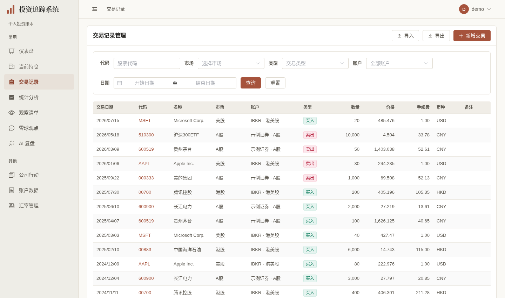
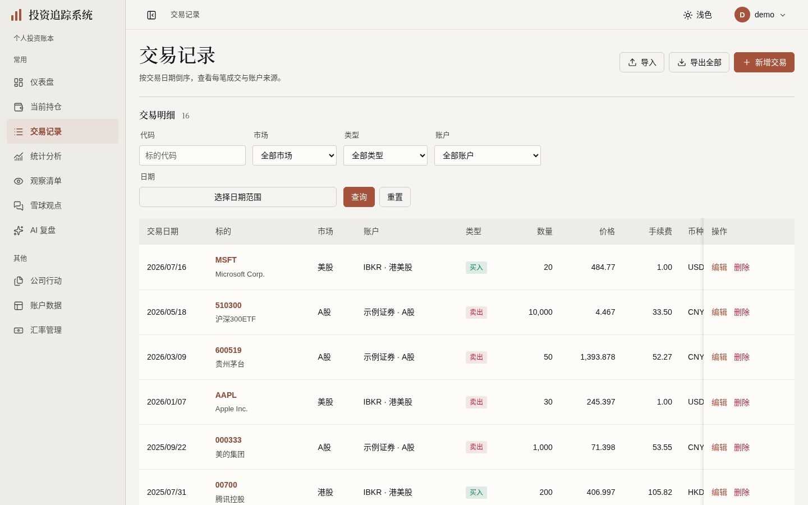

# 交易展示阶段验收（2026-10-03）

依据 [已确认计划第24节（#415）](https://github.com/measimov/investment-tracker/blob/codex/ui-design-records/docs/FRONTEND_UI_UPGRADE_PLAN.md)，分支 `codex/transactions-ui` 依赖日期功能 [#419](https://github.com/measimov/investment-tracker/pull/419)（base `codex/transaction-date-filter`，6d29c97）。只改交易壳层、筛选、表格/卡片及所需状态；无 API、财务算法、数据库迁移或历史数据改写。

## 同数据正式图

使用同一独立虚构 demo 账本，16笔交易；未重灌、写入私有账本或调用付费任务。桌面1440×852 @1x，手机393×852 @2x。完成列表加载后捕获，完整图与特殊状态另存本机证据。既有 `demo:capture` 的交易页流程仍适用。

| 旧交易页（同导航/日期功能） | 新交易页 | 手机 |
|---|---|---|
|  |  |  |

## 保留行为与组件边界

- 日期倒序、用户/账户隔离、列表/count共同筛选、分页/缓存键、重置与全量导出沿用原控制器；日期值仍为ISO。币种、价格/手续费四位与碎股数量继续用已有格式化函数，未改交易成本或收益算法。
- 保留真实持仓深链、完整名称/备注、未知账户状态、只读来源、转仓不可编辑及配对删除确认。业务表单、券商导入/预览/防重、`SecuritySelect`、通知及删除确认继续复用。
- Naive 非 filterable Select 的 `input-props` 未到焦点元素，实际可访问树缺具名控件；三个有限选项改用具名原生select，保留数值账户/未指定/全部及原查询。Naive Pagination页码与上下页为不可键盘聚焦div，因此保留成熟Element分页与局部尺寸，不建设分页/ARIA框架。没有声称本页或全站已移除Element。
- 日期默认双月面板在320px右侧越界、720×450上方裁切。改为本feature局部NModal + 公开DatePicker panel，窄屏上下排、短屏正文滚动、操作常驻页脚。直接键盘输入完整ISO范围；无效/反向范围不能应用，取消/Esc不改已应用筛选，仅确认或清除发起一次列表/count查询。库处理焦点陷阱/返回，无自制定位或键盘算法。
- 日期对话框首次打开才异步加载，之后保持组件挂载，由NModal完成关闭与焦点恢复。只抽实际feature，没有日期平台或bundler变更。
- `usePagedList`只增加最新请求的`loadError`与曾成功加载的`hasLoaded`；首次失败数量为—，刷新失败保留旧数据并明确当前筛选未确认，旧失败不能污染新结果。其余调用方展示不在本轮迁移。

## 六维实际依据

| 维度 | 实际依据与结果 | 范围/限制 |
|---|---|---|
| 视觉与风格 | 暖白/暖灰/陶土、衬线标题、薄分隔；桌面代码与名称分行，金额列等宽右对齐。实际render节点的scoped样式漏达已用本表局部deep修正，逐张查看正式桌面/手机与长名图 | 沿用获认可方向，不自评获奖级；复杂业务弹窗保留成熟展示 |
| 内容与可信度 | 默认16条与同demo API一致；0.085 HKD、0.1234手续费、1,234,567,890.1234数量、长名称、已删除/未指定账户、只读与配对转仓实际回归。显示原币/价格/手续费/账户/日期/备注，未新增虚构生产字段 | 特殊状态为明确浏览器拦截fixture，不写账本；数量与价各自保留原helper |
| 任务与交互 | 原录入/编辑、转仓、券商导入/防重/竞态、导出入口与筛选查询保留。列表初载未知、失败/重试真空、换筛选失败保留非空旧结果；日期应用/清除、真实选日、分页两组范围缓存回归通过 | 无付费/外部任务；危险动作fixture只取消确认，实际写入仅隔离E2E库 |
| 响应式与可访问性 | 自查320/375/393/720×450/768/1024/1101/1440页面及日期四边通过，桌面仅表格横滚，首笔手机卡完整。具名native combobox与Tab、Enter/Space/Esc、首次/第二次日期焦点返回、表格链接ArrowRight原生横滚、Ctrl新标签通过；桌面输入36px，手机输入/select/操作44px | 720×450为200%等效CSS重排，并非literal浏览器缩放；日历指针选择与具名ISO键盘输入均验证，未宣称完整读屏认证 |
| 对比度与状态质量 | 实际alpha合成白底：买入文字4.63:1、卖出5.49:1。证券提示原#a8abb2低对比已局部修为#746f65（4.99:1）；删除hover原3.74:1改用既有danger-text（8.02:1）；日期箭头改公开主题参数使用现有muted。未知、真零、筛空、旧结果提示保持区分 | 仅修触及控件，不更改全局图表或分类色；禁用态与日历密集日期使用库机制 |
| 性能与可维护性 | 同数据五轮生产预览对照，初始gzip JS320824→406908 bytes，增加86084 bytes（84.1KiB/26.8%）；未打开日期不加载其47,058 bytes对话框/DatePicker资源。仍一组list/count、无新依赖/缓存/请求平台 | 必需DataTable共享块及双库过渡成本保留；本地短样本，不声明性能全面改善或全站迁移完成 |

## 性能原值与限制

Chromium，1440×852、同16笔demo、CPU4倍、五轮交替新context、同生产构建配置；`encodedBodySize`为gzip响应体。基线6d29c97，新版为本轮最终业务与样式代码。FCP中位168→172ms，列表就绪中位954.6→779.8ms；短样本与本地网络不能推导真实手机/网络性能提升。初版静态日期加载452221 bytes，按需后减少约44.3KiB，但相对原页仍增加84.1KiB。

| 轮次 | 基线FCP/列表就绪（ms） | 新版FCP/列表就绪（ms） |
|---|---|---|
| 1 | 168 / 829.6 | 172 / 878.6 |
| 2 | 168 / 954.6 | 176 / 853.7 |
| 3 | 172 / 996.9 | 176 / 779.8 |
| 4 | 172 / 964.3 | 148 / 666.1 |
| 5 | 156 / 767.6 | 152 / 674.1 |

实际chunk读取确认：初始`Spin-*.js`约78.9KiB gzip为DataTable/Spin及表格共享组件；首次日期打开才请求`Modal-*.js`（DatePicker/Modal，45686 bytes）与本feature对话框（1372 bytes）。未为减少数字改打包规则或全站换库。

## 验证与独立复核

- 格式、类型、生产构建通过；OpenAPI重新生成无漂移；单元420通过，含两项实际请求失败/过期竞争回归。后端未改，本轮不重复完整后端pytest；依赖#419最新远端后端与前端均通过（前端418 unit / 102 E2E / 4既有跳过）。
- 本轮完整前端初跑101通过/4既有跳过/3失败；均为旧表格定位或全局option同时匹配本页native筛选与导入弹窗。只修相应真实定位，三项导入定向3/3通过；日期异步加载后四项日期/状态/内容定向4/4通过。最终104项通过是完整初跑与修复后的定向合计，远端完整clean CI待确认，不冒充修后又全量运行。
- 首次远端完整检查两项通过：420单元、103 E2E一次通过、1项导航用例重试通过、4既有跳过，不能记为clean104。根隔离复现刷新后初始路由尚未完成便打开抽屉，与既有跨路由关闭行为相竞；只在导航测试reload后等待真实“当前持仓”标题，保留焦点/Esc断言，定向两项导航2/2通过。修复后的远端完整检查待运行。
- 根独立10宽主页面/16条/API、真实href、四边、0外呼/JS异常通过；独立5宽日期无效/反向阻断、取消不发查询、一次应用/清除list+count、实际Jan4/5选日通过；具名select与真实市场/类型/未指定账户API count通过。
- 本机证据：`/tmp/transactions-ui-review/updated-quality.json`（8宽四边）、`final-quality.json`（五轮原值与可访问树）、`final-local-controls.json`（36/44px、提示色、键盘横滚）、`chunks.json`（首次加载/两次焦点返回）；根证据`/tmp/transactions-ui-root-review/`。未提交临时配置、日志、凭证或测试输出。

当前没有本阶段已知阻断；保留组件与额外资源成本如上。未合入、部署或关闭总体前端issues；统计与公司行动仍按独立阶段推进。
