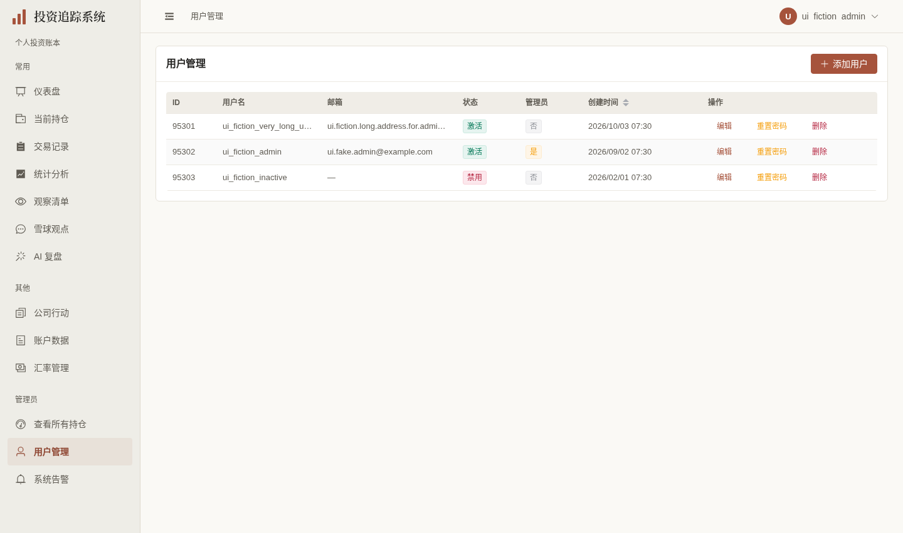
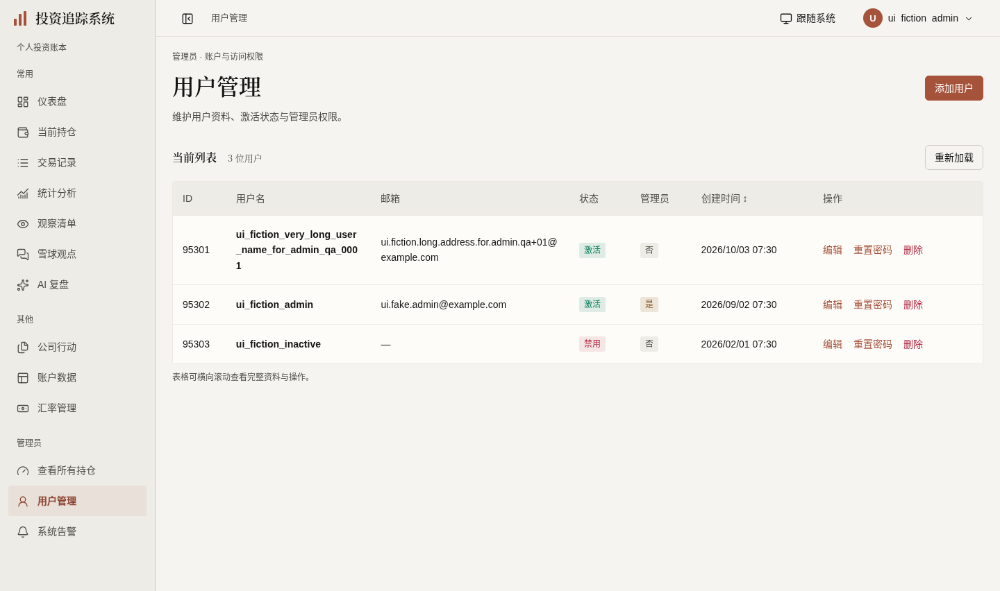
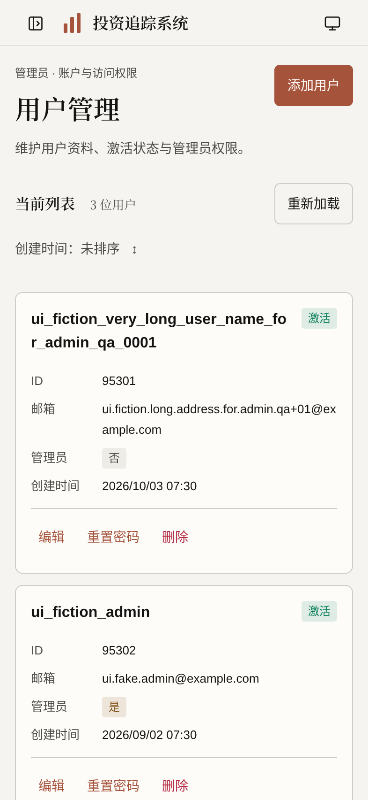

# 用户管理展示验收（2026-10-03）

按[计划第35节](../FRONTEND_UI_UPGRADE_PLAN.md)，`codex/user-management-ui` 基于开放的[观点#430](https://github.com/measimov/investment-tracker/pull/430)。仅本页展示、原读取状态与实际表单可达性；不改变用户接口、管理员保护、会话撤销、角色、分页或迁移，不修改生产用户/口令。

## 同输入正式图

同一[明确虚构合法3用户fixture](user-management-ui-fixture.json)，由专用demo身份登录后仅浏览器模拟管理员展示和GET响应，不入数据库。上海时区、1440×852@1与393×852@2，等待请求/字体/动画；最后capture1通过4.0s（默认页不含此后的两个外层label删除，图中几何不变），所有外部/业务写入阻断，无请求失败/JS异常/连接横幅。

| 旧页 | 新页 | 手机 |
|---|---|---|
|  |  |  |

## 实际问题与最小修复

- `/users`首次503曾显示“暂无数据”。原loader维护成功/error，首次未知为—/尚未加载成功，成功空才0/暂无用户，刷新失败保留旧列表并明确未确认最新结果，各自GET重试。复用useLatestRequest，未建加载平台。
- 暖色页头与薄行分隔，必要UsersTable局部组件提供桌面Naive表格/手机完整资料。用户名、邮箱、ID、两种状态和原formatDateTime不变；创建时间原未排序/升/降三态用具名原生按钮，鼠标/Enter循环及原顺序保持。完整长名/邮箱可换行，空邮箱—；操作具体到用户，桌面至少24、手机44。
- 当前GET原默认100条，数量标“当前列表”，100条时明确不代表全部用户；不增加分页或请求参数。成熟ElForm/ElDialog及原validator/controller保留，邮箱空串仍null、编辑用户名只读、密码10位与重置二次确认不变；遮罩保留草稿，关闭后清密码/旧校验，确认按钮为保存/重置密码/删除。
- 实际保存回归发现原ElButton loading把焦点落BODY，添加与重置保存后库无法回入口。仅两保存按钮复用现有NButton loading（库阻重复、保留焦点），与原busy同步aria-busy/aria-disabled和稳定名称；取消/关闭/Esc忙时保护及原validator后的小重入守卫，全部请求字段不变。未使用手工focus或键盘机制。
- 根旧4189/新4190只读对照证实原ElSwitch Space后视觉/aria为false、隐藏input.checked仍true且可访问树仍checked。仅两Boolean换现有NCheckbox公开checked/Space/Enter，与原form唯一布尔同源；禁用与aria-disabled同条件，具名真实checkbox和手机44。未机械替换成熟表单。最后仅删除两处重复ElFormItem标签，NCheckbox原slot自命名，桌面对齐保持、手机不重复两行。

## 六维实际依据

| 维度 | 实际依据 | 范围与限制 |
|---|---|---|
| 视觉与风格 | 三张同输入图逐张检视，暖白/暖灰/陶土、宋体页头、薄表格、完整长名/邮箱与紧凑操作 | 本页局部，无主题/表格/用户管理平台或获奖级自评 |
| 内容与可信度 | 3合法虚构响应原值，空邮箱—、两状态、UTC23:30上海次日/分钟格式、原排序保持；100限制明确 | 虚构admin仅UI。真实demo普通用户访问管理路由回仪表盘且GET/users403，浏览器未发列表读取；后端守卫原样 |
| 任务与交互 | 首503/真空/旧列表失败/100上限、严格POST/PUT/password原字段、10位/二次确认、遮罩/关闭清理、两保存busy与焦点；重复pointer/Enter仅1 mock请求 | 管理写仅浏览器虚构响应；原删除helper/管理员保护/会话撤销不重写 |
| 响应式与可访问性 | 根十宽320–1920完整资料/body严格不溢，原排序三态实际键盘；手机操作44×44或56×44；具名checkbox Space两次checked与aria一致；另720×450弹窗四边/保存聚焦在视口内 | 720×450为200%等效CSS重排，非literal浏览器缩放；不宣称完整读屏认证，沿现有成熟/原生控件 |
| 状态与对比度 | 未加载/503/真空/旧值明确；393/1440实际状态标签与小字合成背景全部≥4.5，最低“激活”约4.63:1，管理员约4.90，禁用约5.49 | 状态沿既有theme，不修改全局token；缺信息不填0，未扩大权限策略 |
| 性能与维护 | 同fixture/生产/1440×852/CPU4五轮初样JS gzip239687→275041bytes；最后Boolean与attrs后重采273321，增加32.85KiB/14.0%；仍2初始GET | 双库过渡增加，本地短样本数据就绪略慢；不据此宣称全面提升，不建拆包设施 |

## 同条件短样本

| 轮次 | 旧FCP(ms) | 新FCP(ms) | 旧数据就绪(ms) | 新数据就绪(ms) |
|---|---:|---:|---:|---:|
| 1 | 180 | 152 | 543.1 | 503.3 |
| 2 | 156 | 164 | 484.8 | 505.7 |
| 3 | 152 | 152 | 470.8 | 501.9 |
| 4 | 148 | 156 | 473.1 | 507.5 |
| 5 | 152 | 152 | 472.5 | 491.2 |

FCP中位均152ms，数据就绪473.1→503.3ms。五轮在最后Boolean/公开属性修复前，最终只重采资源；不拼接计时。encodedBodySize为gzip口径，最终差33634bytes，初样差35354bytes。主要是本页DataTable与过渡双库；初始GET同为auth/me、users，无新数据请求。其他验收并行的本地4倍CPU短样本，不推导生产性能。

## 验证时点与残项

- 428单元（59文件）通过，API类型重新生成零漂移。最终类型/格式/生产构建通过，无后端/迁移变化，不重复后端pytest。
- 首轮3定向2通过/1真实保存焦点失败；添加修复后重置同因继续修复，严格请求/密码校验断言保持。busy新增检查还发现加载图标影响名称及缺aria-disabled，使用公开属性准确声明。NCheckbox首轮4通过/1测试名字定位失败：slot的aria-labelledby优先于aria-label，公开slot与字段名称一致后真实checked/Space断言通过。
- 完整本地E2E135通过/4既有跳过（4.3m），无失败/重试；该完整门禁在最后两Boolean修复前。最后4本页+1既有手机管理员弹窗共5项受影响回归22.8s通过，不拼成最终完整clean；再删除两处重复label后，严格具名表单1项15.8s通过；320/393真实内容框与唯一label/Space/44px复验通过。当前71bf29d完整远端CI37123168151通过：后端3407/6跳过、428单元（59文件）、E2E135/4既有跳过，无失败或重试。
- 父#430当前0fa312e完整CI37121079421通过：后端3407/6跳过、428单元（59文件）、E2E131/4既有跳过，无失败/重试；其本地130/4在最后展示属性前的历史时点另记于观点验收。
- 本机日志：`/tmp/user-management-targeted.log`、`targeted-final.log`、`targeted-complete.log`、`targeted-delivery.log`、`targeted-last.log`、`targeted-delivery-final.log`、`user-management-unit.log`、`user-management-e2e-full.log`、`user-management-api-types.log`、`user-management-build-final.log`、`user-management-performance.json`、`user-management-final-resources.json`、`user-management-contrast.json`、`user-management-permissions.json`、`user-management-reflow.json`、`user-management-checkbox-labels.json`、`user-management-checkbox-label-targeted.log`、`user-management-capture-final.log`。临时配置与日志、浏览器会话均不入库；生成组件声明无关漂移恢复。
- 根独立`/tmp/admin-users-root-state.json`、`admin-users-root-responsive.json`与`admin-users-root-switch-before.json`对应四状态/十宽/排序及旧Boolean缺陷；最后`admin-users-root-final-fields.json`核真实内容框与手机Boolean目标，`admin-users-root-forms.json`两宽完整原CRUD/password严格mock、取消删除零DELETE、Space与Save/Cancel/Esc焦点通过，`admin-users-root-busy.json`两宽×两窗四态挂请求/重复保护及忙状态全部通过。全部外部/真实业务写/JS错误零。
- 原后端最后活跃管理员、不能自停用/降权/删除自己、session revocation继续由既有实现与门禁保证；未加角色或全站用户工作台。管理员持仓、告警及独立来源D3继续各自PR，总体#362/#367/#368/#369/#370/#353仍有残项，不自动关闭、合并或部署。

父修复同步说明：原71bf29d完整CI37123168151通过是34.2采集开关P2修复前历史；沿真实父链正常merge后的df9244b完整CI已核实后端3407/6跳过、428单元59文件、E2E137/4跳过，无失败/重试；未改本页产品。原门禁/资源/截图时点保留，不用旧通过冒充新head结果。
