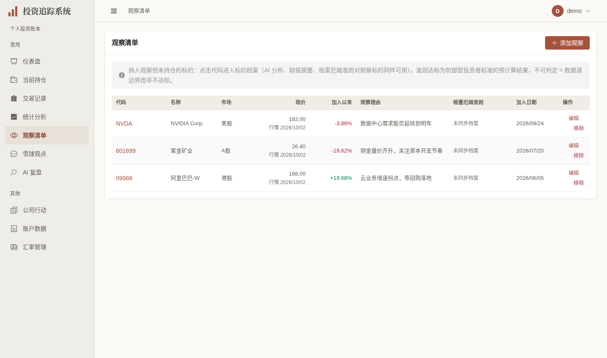
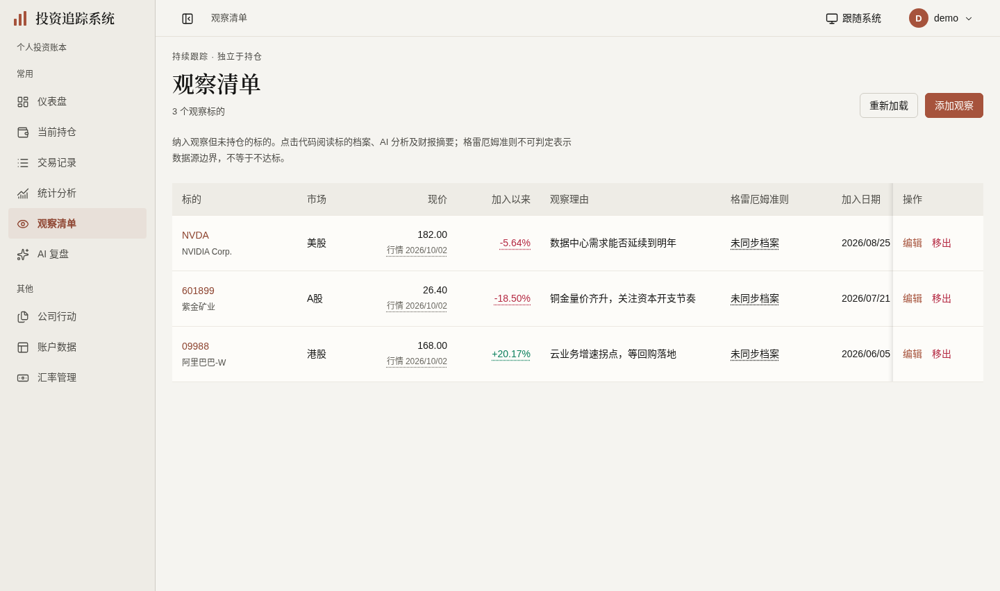

# 观察清单展示验收（2026-10-03）

按[计划第31节](../FRONTEND_UI_UPGRADE_PLAN.md)，分支 `codex/watchlist-ui` 基于 [#425 表单保护](https://github.com/measimov/investment-tracker/pull/425) 的 `0745027`。本轮仅观察页实际呈现、读取状态及已复现的旧自动响应/静默通知缺陷。原保存、移出、表单解析、五分钟重读与编辑时暂停机制保留，无后端、API返回契约、迁移或财务口径变化。

## 同数据正式图

旧425预览与新版使用同一专用虚构demo库，实际API三条观察标的为NVDA、601899、09988；完整JSON相同，价格路径和备注来自既有离线seed，不是市场事实。桌面1440×852@1、手机393×852@2，等待真实请求、字体、加载遮罩及动画完成。

| 旧观察页 | 新观察页 | 手机 |
|---|---|---|
|  |  |  |

正式捕获沿用既有demo登录/等待与配套API，新增具名“观察清单演示账本”步骤，两视口1项通过，无pageerror、请求失败、连接错误或加载遮罩。独立生产预览4186/API18108；未seed、迁移、调用分析或刷新外部行情。

## 已观察缺陷与最小修复

- 503曾与真正空列表同显“暂无观察标的”。原loader增加局部 `hasLoaded/loadError` 与只读重试，首次未成功保持未知，刷新失败保留数据并明确“上次成功加载”。
- 自动GET挂起→编辑保存新备注→手动GET新值→旧GET迟到曾覆盖新备注。直接复用 `useLatestRequest` 守卫成功、错误及finally；最新静默请求接管手动读取也会结束其loading，不建设缓存/同步平台。原name/note PUT及自动暂停不变。
- 旧loader虽标注静默，503仍由公共拦截器弹通知。只让 `getWatchlist` 前端wrapper接收既有 `skipGlobalErrorNotification`，自动调用启用，首次/手动不启用；全局维护、连接和认证状态完整保留。
- 首版真实长名称撑宽手机卡片，补本页min-width与完整换行；桌面长理由原位details展开全文，保持紧凑行。实际桌面方向色曾被说明button的inherit覆盖，将既有pnlClass绑定外层解决，正负原色及数值均未改变。
- 本页复用原SecuritySelect/ElForm/ElSelect/ElDialog，实际市场和输入名称/键盘可达。仅加遮罩保护、编辑时清旧校验、既有暖色placeholder变量和手机44px输入/选择器包装；没有重写复杂表单。末次实测桌面text按钮仅14px高，局部表格anchor补min-height24，手机保持44px；正常行高不变。移出确认明确写“移出观察”，详情入口改真实RouterLink。
- 公告同步 `last_synced` 是后端纯date，仅沿原共享helper复用formatDate显示为2026/09/29；不改变原始日期、分组、徽标短月日或游标。

## 六维实际依据

| 维度 | 实际依据与结果 | 范围与限制 |
|---|---|---|
| 视觉与风格 | 暖白/暖灰/陶土、实际宋体页头、薄行分隔、标的主副层级和数值右对齐。正式三图及长内容图逐张检查；手机首屏完整首卡、正常价格与加入以来变化可读 | 不自评获奖级；仅本页表格/手机展示，不建设通用表格或主题平台 |
| 内容与可信度 | 同实际demo API完整JSON一致；压力fixture保留0.0851、1.409、+6.38%、0.00%、-5.08%、未知价/未知基准、行情2026/01/02与加入时间本地2026/01/03。准则仍分达标/不达标/不可判定/未同步 | describePrice、describeChangeSinceAdded、Graham判定helper未改；“同币种、不含分红”及完整来源说明保留，未手写生产数据 |
| 任务与交互 | 原增删改及详情加入观察完整流程通过；失败只读重试、旧数据标识、自动迟到响应、编辑暂停、静默接管manual loading通过。自动503零popup、手动503有popup且保留维护状态 | 并发/失败样例及PUT均明确浏览器模拟；原CRUD只独立E2E库。没有真实生成、外呼或演示账本写入 |
| 响应式与可访问性 | 自查8宽320–1920、根10宽含640/641断点与720×450，body/document等于viewport；长名/备注完整。桌面三个说明Enter开关、四边/正文/焦点与移除通过，手机原生details Enter通过；真实href及成熟表单市场键盘保留 | 720×450为200%等效CSS重排，非literal浏览器缩放；桌面行操作24px；手机按钮/summary≥44px，输入/选择器包装44px；采用原生/成熟机制，不宣称完整读屏认证 |
| 对比度与状态质量 | 实际正/负为rgb(4,120,87)/rgb(180,35,62)，中性不着方向色；可见表单placeholder从rgb(168,171,178)修为既有rgb(116,111,101)，对白约5.00:1。手工/陈旧来源、缺值与未知基准说明可展开，失败不伪空 | 小字/限制说明沿既有muted和局部深色陈价文本；不改全局颜色或图表分类色。静默不隐藏真实全局服务问题 |
| 性能与可维护性 | 同实际三条demo、1440×852、生产构建、4倍CPU、五轮交替：gzip JS263179→314019bytes；最后wrapper/表单小修重采314069bytes，实际增加49.7KiB/19.3%。四个请求路径不变，主要新增已存在DataTable chunk58.8KiB | 双库过渡成本如实保留，不声称体积/性能全面提升，不为该成本建设拆包框架。短样本FCP中位152ms相同，就绪545.7→523.4ms，不能推导真实手机/网络表现 |

## 同条件短样本

| 轮次 | 旧FCP(ms) | 新FCP(ms) | 旧数据就绪(ms) | 新数据就绪(ms) |
|---|---:|---:|---:|---:|
| 1 | 176 | 144 | 589.8 | 515.2 |
| 2 | 148 | 152 | 539.5 | 523.4 |
| 3 | 152 | 152 | 545.7 | 561.1 |
| 4 | 168 | 152 | 557.9 | 519.5 |
| 5 | 148 | 156 | 541.4 | 523.6 |

计时在最后静默config和弹窗样式前完成，最后仅重采实际资源。请求路径同为auth/me、watchlist、announcements/recent、auth/refresh；后者为既有滑动会话续期。无新增取数、依赖或定时任务。

## 验证时点与残项

- 428单元（59文件）、最终格式/类型/生产构建通过；OpenAPI重新生成无漂移，生成组件声明的无关删项已恢复。无后端变更，不重复完整pytest。
- 最初5项定向4通过/1测试定位失败：loading装饰图标改变reload按钮名称，补公开稳定aria-label后5项通过。与CI同workers=1完整首轮119通过/4跳过/2失败：一处旧公告日期期待、一处误改交易按钮定位，均精确修正后2项通过，金融与控制器断言保留。
- 最后自动/手动503实际缺陷修复后，原CRUD/证券/公告/准则与4个真实状态/乱序回归共8项通过。之后仅本页表单placeholder/手机尺寸样式，实际320/393/1440名称/市场键盘、遮罩草稿、取消/Esc/focus复验通过；未将全量与定向合计当成最终clean完整结果。bbf350d2完整远端CI37113636368：后端3407/6跳过、428单元、E2E122/4跳过，无失败或重试。
- 父#425最新0745027完整CI37110550376：后端3407/6跳过、428单元、E2E118/4跳过，无失败或重试。独立main-base#426仅Dashboard测试等待离场DOM移除，10次重复通过；2c698c7完整CI37110966270为后端3407/6跳过、420单元、104E2E/4跳过，无重试；与当前堆叠分支计数分开。
- 本机证据：`/tmp/watchlist-api-parity.json`、`watchlist-responsive-review.json`、`watchlist-form-final.json`、`watchlist-row-targets-final.json`、`watchlist-performance.json`、`watchlist-final-resources.json`、`watchlist-e2e-full.log`、`watchlist-final-targeted.log`、`watchlist-demo-capture-final.log`。根独立 `watchlist-root-responsive.json`、`watchlist-stale-auto-root-final.json`、`watchlist-silent-error-root-final.json`，业务写/外呼/JS错误均零（需要PUT的竞态仅浏览器模拟）。临时配置、日志、凭据和压力fixture不入库。
- 汇率、账户、意见源、管理员页和单独来源能力D3继续按计划逐页验收；复杂表单保留成熟实现。总体#362/#367/#368/#369/#370/#353仍有残项，没有合入、部署或关闭总体issue。
